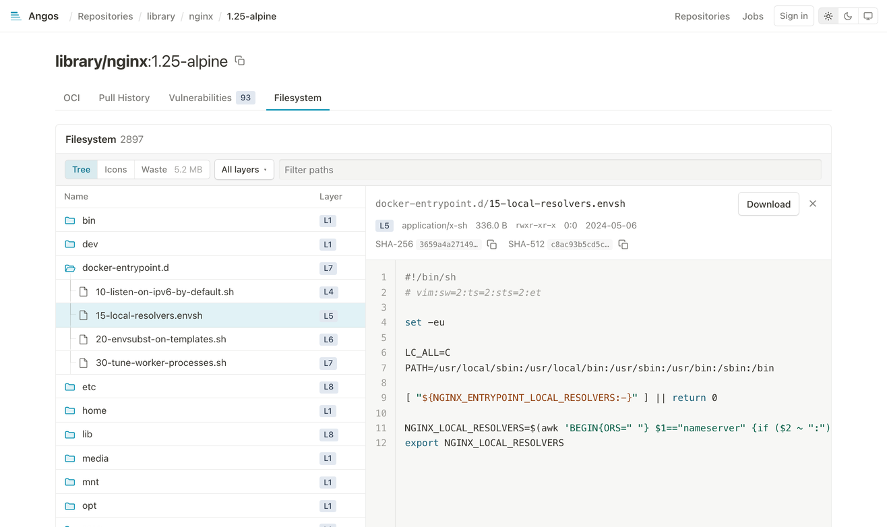

<div align="center">


# Angos

A container registry that's simple to run and a pleasure to use.

**[Website](https://project-angos.github.io/angos/)** · **[Documentation](doc/)** · **[Quick Start](doc/tutorials/quickstart.md)**

</div>

Angos is an OCI registry you configure in one file and run without a database. Its web UI shows
what is inside every image, layer by layer, with scan reports and pull history alongside.

<picture>
  <source media="(prefers-color-scheme: dark)" srcset="doc/images/ui-tour-dark.png">
  
</picture>

<sub>The web UI in turn: an image's merged filesystem, the secrets found in its layers, a file compared with
the layer below, a vulnerability report, and pull history.</sub>

## Little to look after

There is no database or lock service to run beside Angos. Everything it knows lives in the storage
that holds your images, a directory or an S3 bucket.

- **Servers are disposable**: start another instance on the same storage and it serves everything the last one did.
- **Scale by adding replicas**: replicas share the same bucket, with nothing to coordinate them.
- **Maintenance while it serves**: garbage collection, scrub and prune run beside the live registry.
- **Changes without restarts**: the configuration and TLS certificates reload when their files change.

## Features

- **OCI 1.1 compliant**: Docker, Podman, containerd and any OCI tool, with referrers for signatures and SBOMs
- **Pull-through cache**: mirror Docker Hub, ghcr.io or any upstream; immutable tags skip the upstream check
- **Replication**: mirror repositories to downstream registries in both directions, with a durable retry queue
- **Access policies**: CEL expressions decide who may push, pull or delete, per repository, with optional webhook authorization
- **Passwordless CI**: OIDC from GitHub Actions, Kubernetes or any issuer, a token service, and mTLS client certificates
- **Retention**: keep tags by age, semver pattern, or recent pushes and pulls
- **Immutable tags**: protect release tags from being overwritten, with exclusions
- **Vulnerability scanning**: Trivy or Grype on push, the report kept next to the image as an OCI referrer
- **Event webhooks**: required, optional or asynchronous delivery of push and delete events
- **Web UI**: browse repositories, manifests, referrers, pull history and image filesystems
- Written in Rust, with no unsafe code

## Quick Start

```bash
# Create a minimal config
cat > config.toml << 'EOF'
[server]
bind_address = "0.0.0.0"
port = 8000

[blob_store.fs]
root_dir = "./registry-data"

[global.access_policy]
default = "allow"

[repository."test"]
EOF

# Run the registry
./angos -c config.toml server

# Push an image
docker tag alpine:latest localhost:8000/test/alpine:latest
docker push localhost:8000/test/alpine:latest
```

See the [Quickstart Tutorial](doc/tutorials/quickstart.md) for a complete walkthrough.

## Documentation

The complete documentation index lives in [doc/index.md](doc/index.md).

### Tutorials

- [Quickstart](doc/tutorials/quickstart.md) - Get a registry running in 5 minutes
- [Your First Private Registry](doc/tutorials/your-first-private-registry.md) - Add authentication and access control
- [Mirror Docker Hub](doc/tutorials/mirror-docker-hub.md) - Set up a pull-through cache

### How-To Guides

- [Deploy with Docker Compose](doc/how-to/deploy-docker-compose.md)
- [Deploy on Kubernetes](doc/how-to/deploy-kubernetes.md)
- [Configure mTLS](doc/how-to/configure-mtls.md)
- [Configure GitHub Actions OIDC](doc/how-to/configure-github-actions-oidc.md)
- [Push from GitHub Actions](doc/how-to/push-from-github-actions.md)
- [Configure OIDC](doc/how-to/configure-generic-oidc.md)
- [Set Up Access Control](doc/how-to/set-up-access-control.md)
- [Configure Retention Policies](doc/how-to/configure-retention-policies.md)
- [Protect Tags with Immutability](doc/how-to/protect-tags-immutability.md)
- [Configure Webhook Authorization](doc/how-to/configure-webhook-authorization.md)
- [Configure Event Webhooks](doc/how-to/configure-event-webhooks.md)
- [Scan Images with an External Scanner](doc/how-to/scan-images.md)
- [Explore Image Filesystems](doc/how-to/explore-image-filesystems.md)
- [Configure Replication](doc/how-to/configure-replication.md)
- [Run Storage Maintenance](doc/how-to/run-storage-maintenance.md)
- [Enable Durable Cache Jobs](doc/how-to/durable-cache-jobs.md)
- [Enable the Web UI](doc/how-to/enable-web-ui.md)
- [Troubleshoot Common Issues](doc/how-to/troubleshoot-common-issues.md)
- [Upgrade Angos](doc/how-to/upgrade.md)

### Reference

- [Configuration Reference](doc/reference/configuration.md)
- [CLI Reference](doc/reference/cli.md)
- [CEL Expressions Reference](doc/reference/cel-expressions.md)
- [API Endpoints Reference](doc/reference/api-endpoints.md)
- [Web UI Reference](doc/reference/ui.md)
- [Event Webhooks Reference](doc/reference/event-webhooks.md)
- [Metrics Reference](doc/reference/metrics.md)

### Understanding Angos

- [Architecture Overview](doc/explanation/architecture.md)
- [Storage Backends](doc/explanation/storage-backends.md)
- [Authentication and Authorization](doc/explanation/authentication-authorization.md)
- [Pull-Through Caching](doc/explanation/pull-through-caching.md)
- [Bi-Directional Replication](doc/explanation/replication.md)
- [Security Model](doc/explanation/security-model.md)

## Upgrading

Version-specific migration notes are in the [Upgrade guide](doc/how-to/upgrade.md).

## Usage

```
Usage: angos [-c <config...>] <command> [<args>]

An OCI-compliant and docker-compatible registry service

Options:
  -c, --config      path to a configuration file, repeatable to merge several
                    with later files winning, defaults to `config.toml`
  --help, help      display usage information

Commands:
  argon             Hash a password following the argon2id algorithm
  prune             Enforce retention policies and reclaim aged upload-lifecycle
                    leftovers
  reconcile         Reconcile stored content with the configuration
  scrub             Walk the store, repair inconsistencies, and quarantine
                    unrecognized objects
  server            Run the registry listeners
  scanner           Run the scanner service that answers scan jobs with SARIF
                    reports
  worker            Process durable background jobs
```

## Additional Endpoints

In addition to the standard OCI Distribution endpoints:

- `/healthz`: Liveness health check endpoint
- `/readyz`: Readiness health check endpoint
- `/metrics`: Prometheus metrics endpoint

## References

- [OCI Distribution Specification](https://github.com/opencontainers/distribution-spec/blob/main/spec.md)
- [OCI Image Specification](https://github.com/opencontainers/image-spec)
- [OCI Image Index](https://github.com/opencontainers/image-spec/blob/main/image-index.md)
- [Docker Registry HTTP API V2](https://github.com/openshift/docker-distribution/blob/master/docs/spec/api.md)
