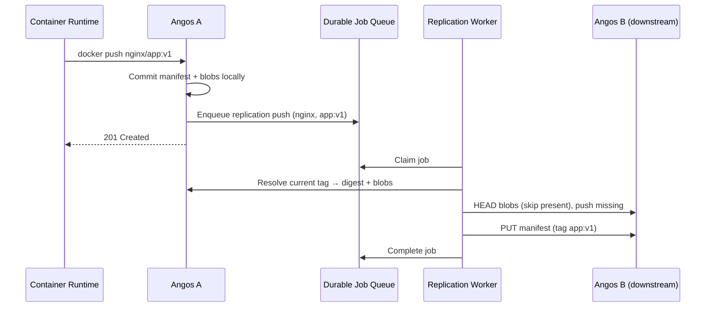

# Bi-Directional Replication

Where [pull-through caching](pull-through-caching.md) pulls content *in* from upstream registries on demand, replication pushes content *out* to one or more downstream registries as local state changes. Two or more Angos instances configured as each other's downstreams converge to the same view of every replicated repository.

## The Replication Model

Replication is configured **per repository**, mirroring the `upstream` model. Each repository declares a list of **downstreams**: other registries to which its mutations are mirrored.

### Triggers

The push path is driven by **manifest mutations only**:

- **Manifest push** (which also covers tag creation) enqueues a replication push.
- **Manifest delete** (which also covers tag deletion) enqueues a replication delete.

Blob uploads do **not** trigger replication on their own. Blobs are replicated as **dependencies of the manifest-push pipeline**: before pushing a manifest, the pipeline enumerates every blob and child manifest it references and ensures each is present on the downstream first. This keeps the downstream consistent: a manifest never lands before the content it points to. A missing blob is mounted cross-repository (no body transfer) when a sibling repository already holds it on the downstream, and only streamed when no such mount is possible.

### Multi-arch images and referrers

The push pipeline is recursive:

- For an image index (`application/vnd.oci.image.index.v1+json` or a Docker manifest list), the pipeline recurses into **child manifests first**. The parent index is pushed only after every child is present on the downstream.
- When a manifest carries a `subject` (an OCI 1.1 referrer), the pipeline pushes the referrer. Against an OCI 1.0 downstream that does not index referrers automatically, it falls back to pushing the referrers-fallback tag manifest, and a later delete of that referrer drops its descriptor from the fallback index (removing the tag once empty).

### Digest algorithms

A push transfers content under the digest algorithm of the local copy (sha256 or sha512), so each downstream must accept that algorithm. A downstream that rejects it (for example a sha256-only registry receiving a sha512 digest) fails the push. The job then retries and dead-letters like any other persistent rejection, so the divergence stays visible to operators rather than being silently dropped. Keep replicating peers on builds with matching algorithm support, or replicate only content addressed with the common algorithm.

## The Durable Job Queue Substrate

Replication does not maintain its own outbox. It rides the same **durable job queue** that backs pull-through cache-fill work (see [Enable Durable Cache Jobs](../how-to/durable-cache-jobs.md)). Each mutation enqueues a small `JobEnvelope` onto a single `replication` queue. The queue gives replication:

- **Durability**: pending jobs persist to the metadata store under `_jobs/pending/replication/` and survive restarts. Stop a downstream, keep pushing locally, and the backlog drains when it returns.
- **Coalescing**: the queue deduplicates on a `lock_key` of `(operation, downstream, namespace, tag)`. A second push to the same tag while one is pending is a no-op; the handler re-resolves the **current** tag-to-digest mapping at execution time, so the latest content wins regardless of how many enqueues coalesced. A push and a delete for the same tag carry different keys and do not collapse into each other, and each distinct delete carries its change timestamp in the key, so a newer deletion never folds into a pending older one (only retries of the same deletion coalesce).
- **Retry and backoff**: failed pushes are retried with exponential backoff.
- **Dead-letter**: jobs that exhaust their attempts move to a failed queue, visible (and retryable) from the admin UI.
- **Backlog visibility**: the `angos_job_queue_pending{queue="replication"}` gauge reports actionable depth.

Because the queue is at-least-once, every replication push must be idempotent. The pipeline HEADs blobs and manifests on the downstream before transferring, so a redelivered job is cheap.

> **Replication backlog does not gate readiness.** Replication is asynchronous and eventually consistent. A deep queue is the *normal* state during a downstream outage; flipping `/readyz` on backlog would pull a node from rotation exactly when it should be draining. Backlog and staleness are surfaced via metrics (see [Metrics Reference](../reference/metrics.md)) for operators to alert on, never via a readiness gate.

## Loop Prevention

In an active-active mesh, a push from A to B must not bounce back from B to A, and an A↔B↔C topology must not loop indefinitely. Angos prevents this with **no-op suppression**: an instance re-dispatches a replication push or delete only when the inbound write actually **changed local state**.

When B receives A's push and applies it, B's tag genuinely moves, so B forwards the change onward. When that change circles back to a node that already holds it (the tag already resolves to that digest, or the deleted reference is already absent) the write is a no-op, so the node does **not** re-dispatch it and the cycle terminates. This holds for any topology, including 3+-node meshes whose cycle does not pass through the original author. (A transient failure to read the prior state fails open, meaning the change is re-dispatched, so a genuine change is never silently suppressed.)

As a belt-and-suspenders measure, the push pipeline HEADs the manifest on the downstream before transferring the body; a matching digest means no transfer occurs.

## Conflict Resolution: Last-Writer-Wins

When two instances write the same **tag** concurrently, replication resolves the conflict with **last-writer-wins (LWW)** by event timestamp:

- Every outgoing replication request carries an `X-Angos-Source-Timestamp` header (RFC 3339) with the time the change occurred.
- On the receiver, for a **tag** reference, the incoming `X-Angos-Source-Timestamp` is compared against the local tag's `LinkMetadata.created_at`. If the local copy is **strictly newer**, the write is rejected with `409 REPLICATION_SUPERSEDED`.
- Two **distinct** writes stamped with the identical timestamp are ordered by **digest**: the larger digest wins on every node, so the order is total and an equal-timestamp pair converges instead of swapping forever. An equal digest is the same content (a converged replay) and is accepted.

LWW applies **only to tags**: digest references are content-addressed and never conflict. A `REPLICATION_SUPERSEDED` rejection is **convergence, not failure**: the sender treats it as a successful drop (the job completes and is removed from the queue), because the downstream already holds a newer value. This is distinct from an *immutable-tag* `409 CONFLICT`, which is an operator misconfiguration: the sender surfaces it and lets the job retry or dead-letter. Such a job never converges: the receiver rejects every retry until the job dead-letters, and the next reconcile re-enqueues it, so the push is retried and dead-lettered forever. Consequently `immutable_tags` and active-active (event/reconcile) replication are effectively incompatible for the same tag set: mark a tag immutable only on tags you do not replicate, or replicate only tags you do not mark immutable.

A genuine end-user write (one that arrives without an `X-Angos-Source-Timestamp` header) skips LWW entirely, so replication never interferes with direct pushes.

LWW orders by the **originating author's write time**, not each receiver's clock: a replicated write persists the incoming `X-Angos-Source-Timestamp` as the tag's `LinkMetadata.created_at`, and re-dispatch re-derives the timestamp from it, so author time propagates verbatim across hops and multi-hop ordering is deterministic. (The author timestamp is also stored on the manifest *revision*, so a tag's and revision's `pushed_at` and retention age stay consistent across peers. One operational caveat: back-filling old history into a peer with a tight max-age retention policy can make it eligible for pruning on the next scrub, since age is measured from the author's push time, not the receive time.) The one remaining non-strictness is that the receiver's compare-then-write is not atomic, so two replicated writes to the same tag arriving together can both pass and the later commit wins; the mesh still converges because re-replication re-arbitrates.

## Scrub Reconciliation

The event path can miss changes: an instance might be down when a mutation occurs, or two instances might drift after a long partition. The `angos scrub --replicate` command reconciles a divergence on demand:

- It walks every replicated namespace and, for each repository downstream (gated by `mode` and `namespace_filter`), probes each local tag on the downstream with `HEAD manifest` (and, when pruning is enabled, enumerates the downstream's tags with `list-tags`). These are the only OCI-required endpoints it uses, so reconciliation works against any compliant registry.
- For each tag that diverges, or that exists locally but not on the downstream, it **enqueues a replication push** through the same handler and queue as the event path. Reconciliation does not push inline; it gets the same durable retry, backoff, dead-letter, and coalescing as live mutations.
- By default reconciliation is **additive** (push-only) and never deletes. A downstream marked `prune = true` (an authoritative one-way mirror) is the exception: reconciliation also enumerates its tags via `list-tags` and **enqueues a delete** for any tag absent locally, so it converges exactly to the local tag set. Pruning is destructive and unsafe for active-active peers (it would remove a tag the peer authored that has not yet replicated back), so it is off by default.

Running `--dry-run` reports the replication actions that would be taken without enqueuing anything: an `EnqueueReplicationPush` per diverging or downstream-missing tag, plus an `EnqueueReplicationDelete` per downstream-only tag on a `prune = true` downstream. Reconciliation is operator-driven (cron, Kubernetes CronJob, systemd timer); there is no in-server scheduler.

## Replication Modes

Each downstream declares a `mode` that gates which paths apply to it:

| Mode | Event path (live pushes) | Scrub reconciliation |
|------|--------------------------|----------------------|
| `event+reconcile` (default) | Yes | Yes |
| `event-only` | Yes | No |
| `reconcile-only` | No | Yes |

## Where Work Runs

Whether a separate worker is required depends on the durable job queue configuration:

- **No `[global.job_queue]`**: the server self-drains the replication queue in-process. Jobs still persist to the same fs/S3 store the registry uses (under `_jobs/`) and resume after a restart; this is simply one process doing both the serving and the draining, with no cross-replica coordination and no queue-depth gauge. A two-instance active-active demo needs no separate worker.
- **With `[global.job_queue]`**: the server only enqueues; run `angos worker --queue replication` to drain the queue from a separate process (or pool). The difference from in-process draining is *where* work runs and how it scales (cross-replica coordination, the autoscaler gauge), not whether jobs are durable. Because the push and staleness metrics increment in the draining process, they are scrapeable only in in-process mode; see [Replication Metrics](../reference/metrics.md#replication-metrics).

## See Also

- [Configure Replication](../how-to/configure-replication.md): setup guide
- [Pull-Through Caching](pull-through-caching.md): the inbound counterpart
- [Metrics Reference](../reference/metrics.md): replication metrics
- [Configuration Reference](../reference/configuration.md): downstream and global options
