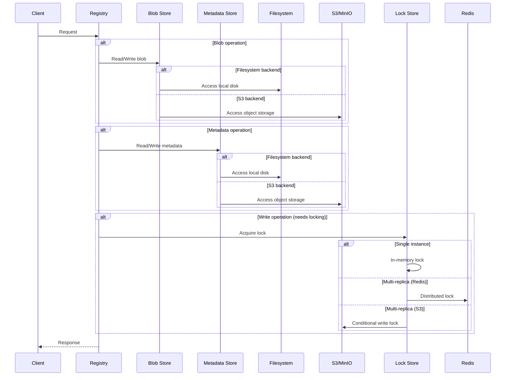
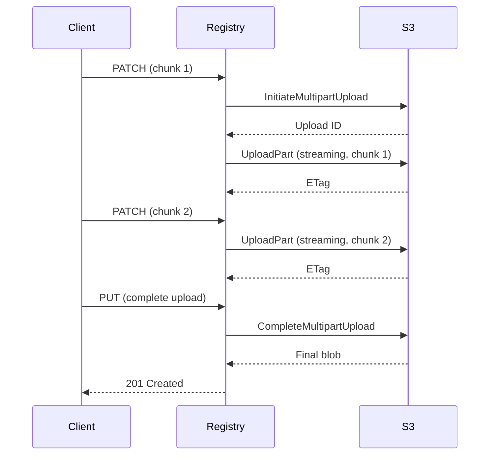
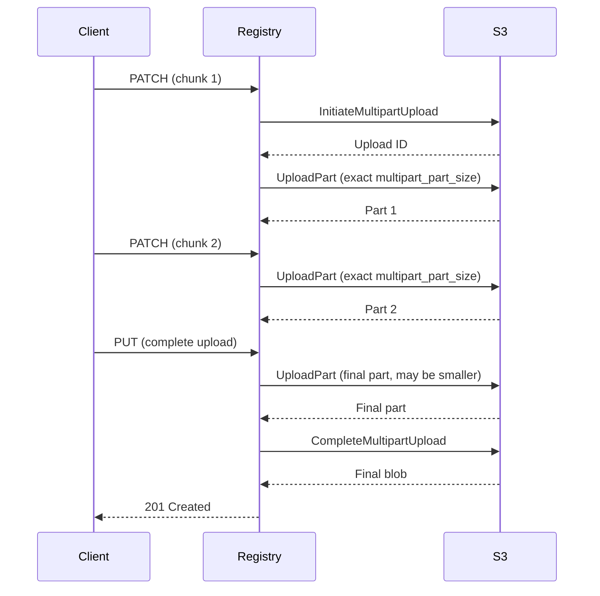

# Storage Backends

Angos supports two storage backends: filesystem and S3-compatible object storage.
This document explains when to use each and their trade-offs.

## Overview



---

## Blob Store vs Metadata Store

Angos separates storage into two logical stores:

| Store              | Contents               | Size       | Access Pattern          |
|--------------------|------------------------|------------|-------------------------|
| **Blob Store**     | Layer data, configs    | Large (GB) | Sequential read/write   |
| **Metadata Store** | Manifests, tags, links | Small (KB) | Random access, frequent |

By default, both use the same backend. You can configure them independently:

```toml
# Both filesystem
[blob_store.fs]
root_dir = "/data/blobs"

[metadata_store.fs]
root_dir = "/data/metadata"
```

```toml
# Or split: blobs on S3, metadata on filesystem
[blob_store.s3]
bucket = "registry-blobs"
# ...

[metadata_store.fs]
root_dir = "/data/metadata"
```

---

## Filesystem Backend

### When to Use

- Single-instance deployments
- Development and testing
- When S3 is not available
- Low-latency requirements

### Configuration

```toml
[blob_store.fs]
root_dir = "/var/registry/data"
sync_to_disk = false  # Set true for durability

[metadata_store.fs]
root_dir = "/var/registry/data"  # Can be same as blob store
```

### Trade-offs

**Advantages:**
- Simple setup
- Low latency
- No external dependencies
- Cost-effective for small deployments

**Disadvantages:**
- Single-instance only: no multi-replica support without a shared storage
- No built-in redundancy or high availability
- Shared filesystem (NFS, EFS) not recommended for production (see below)

### Durability Options

```toml
[blob_store.fs]
root_dir = "/data"
sync_to_disk = true  # fsync after writes
```

- `sync_to_disk = true`: Every write is flushed to disk with `fsync()`, guaranteeing durability at the cost of higher write latency.
- `sync_to_disk = false` (default): Relies on OS page cache for better performance. Acceptable when the underlying storage already provides durability guarantees (e.g., battery-backed RAID, ZFS, cloud block storage with replication). Without such guarantees, data may be lost on crash or power failure.

---

## S3 Backend

### When to Use

- Multi-replica deployments
- High availability requirements
- Large storage needs
- Cloud-native infrastructure

### Configuration

```toml
[blob_store.s3]
access_key_id = "AKIA..."
secret_key = "..."
endpoint = "https://s3.amazonaws.com"
bucket = "my-registry"
region = "us-east-1"
key_prefix = "blobs/"  # Optional

# Multipart settings
multipart_part_size = "50MiB"
multipart_copy_threshold = "5GB"
multipart_copy_chunk_size = "100MB"
multipart_copy_jobs = 4

# Reliability settings
max_attempts = 3
operation_timeout_secs = 900
operation_attempt_timeout_secs = 300
```

### Trade-offs

**Advantages:**
- Unlimited scalability
- Built-in redundancy
- Multi-replica support
- Pay-per-use pricing

**Disadvantages:**
- Higher latency than local disk
- Network dependency
- Potential egress costs
- Requires distributed locking configuration for multi-replica

### Compatible Services

- AWS S3
- MinIO
- Exoscale SOS
- DigitalOcean Spaces
- Backblaze B2
- Cloudflare R2
- Any S3-compatible storage

---

## Multi-Replica Deployments

For multiple registry instances, you need:
1. **Shared storage**: S3 or shared filesystem
2. **Distributed locking**: Redis or S3

### With S3 Locking (Simplest)

Uses S3 conditional writes (`If-None-Match: *`) for locking — no extra infrastructure required. The S3 provider must support conditional writes; Angos verifies this at startup.

```toml
[blob_store.s3]
bucket = "registry-data"
# ... S3 config

[metadata_store.s3]
bucket = "registry-data"
# ... S3 config
```

To customize lock behavior:

```toml
[metadata_store.s3.lock_strategy.s3]
ttl_secs = 30          # Lock expiry (default: 30)
max_retries = 100      # Acquisition attempts (default: 100)
retry_delay_ms = 50    # Delay between retries (default: 50)
```

### With S3 + Redis

```toml
[blob_store.s3]
bucket = "registry-data"
# ... S3 config

[metadata_store.s3]
bucket = "registry-data"
# ... S3 config

[metadata_store.s3.lock_strategy.redis]
url = "redis://redis:6379"
ttl = 10
key_prefix = "registry-locks"

[cache.redis]
url = "redis://redis:6379"
```

---

## Locking Behavior

### In-Memory Locking (Default)

- Used when Redis is not configured
- Only safe for single-instance deployments
- No coordination between replicas

### Redis Locking

Suitable for multi-replica with any storage backend:

```toml
[metadata_store.fs.lock_strategy.redis]
url = "redis://redis:6379"
ttl = 10                    # Lock timeout in seconds
key_prefix = "locks"        # Optional prefix
max_retries = 100           # Retry attempts
retry_delay_ms = 10         # Delay between retries
```

**Legacy form:** The `[metadata_store.*.redis]` table (e.g., `[metadata_store.fs.redis]`) is still accepted for backward compatibility and is equivalent to `[metadata_store.*.lock_strategy.redis]`. New configurations should use the `lock_strategy` form.

### S3 Locking

Available only when using S3 for metadata (not supported with filesystem metadata stores). Uses conditional writes (`If-None-Match: *`) to implement distributed locks directly in the S3 bucket, eliminating the need for Redis. Stale locks are automatically recovered after TTL expiry.

Lock operations use a dedicated S3 client with independent timeout configuration, separate from the metadata store's main S3 client. This allows tuning lock behavior independently — lock operations should fail fast rather than blocking for minutes, which is important in high-latency S3 scenarios.

```toml
[metadata_store.s3.lock_strategy.s3]
ttl_secs = 30               # Lock expiry in seconds (minimum: 9)
max_retries = 100           # Acquisition retry attempts
retry_delay_ms = 50         # Delay between retries (minimum: 1)
```

The heartbeat interval is automatically calculated as `ttl_secs / 3`. For example, with the default `ttl_secs = 30`, heartbeats occur every 10 seconds. The minimum `ttl_secs` value is 9 seconds, resulting in a minimum heartbeat interval of 3 seconds.

:::note
The S3 provider must support conditional writes. Angos probes for this capability at startup and fails fast if it is not available.
Known providers that support conditional writes: AWS S3, MinIO, Exoscale SOS.
:::

If your S3 provider does not support conditional writes, use Redis locking instead:

```toml
[metadata_store.s3.lock_strategy.redis]
url = "redis://redis:6379"
ttl = 10
key_prefix = "registry-locks"
```

---

### Shared Filesystem (Not Recommended)

**Not recommended for production.** Shared filesystems (NFS, EFS) introduce operational complexity that defeats Angos's stateless design:

- **Lock handling**: Distributed locking on shared filesystems is complex and error-prone
- **Performance tuning**: NFS requires careful tuning of cache coherency and lock protocols
- **Recovery**: Handling stale locks and crashed instances is difficult without explicit consensus mechanisms
- **Scaling issues**: Lock contention worsens as replicas increase

**For multi-replica deployments, use S3 instead.** S3 provides distributed locking natively (via conditional writes) with no additional infrastructure, better operational clarity, and superior scalability.

Lock is held during:
- Manifest writes (tag updates)
- Blob link creation
- Upload completion

### Monitoring Lock Operations

Lock operations emit Prometheus metrics for observability. Key metrics to monitor:

- `lock_acquisition_duration_ms` — Histogram of lock acquisition times (e.g., p99 > 500ms indicates S3 latency degradation)
- `lock_retries_total` — Counter of lock acquisition retries (e.g., rising rate indicates lock contention)
- `lock_invalidations_total{reason="heartbeat_failure"}` — Stale heartbeat failures (e.g., indicates S3 connectivity issues)
- `lock_recoveries_total` — Counter of stale lock recovery attempts (e.g., indicates crashed instances)

For multi-instance deployments, alert on:
- **High `lock_retries_total` rate**: Rising retry rate during normal operation suggests lock contention and may indicate insufficient `max_retries` or `retry_delay_ms` tuning.
- **`lock_invalidations_total{reason="heartbeat_failure"}`**: Heartbeat failures suggest network issues between the registry and S3. Consider checking S3 connectivity, network quality, and lock timeout settings.
- **High `lock_acquisition_duration_ms` p99**: Persistent p99 latency > expected S3 latency may indicate saturation or regional latency issues.

See the [configuration reference](../reference/configuration.md#prometheus-metrics) for the full metrics list.


---

## Blob Upload Modes (S3)

The registry supports two modes for uploading blobs to S3. By default, it uses the **non-uniform upload mode**, which is faster and works with most S3 providers. If your S3 provider requires uniform part sizes, switch to **uniform upload mode**.

### Non-Uniform Upload Mode (Default)

This is the recommended mode for most deployments. Each OCI `PATCH` request streams directly to S3:



Configuration:

```toml
[blob_store.s3]
multipart_uniform_parts = false  # Default
```

Each `PATCH` streams directly into the multipart upload as an `UploadPart` — no intermediate objects, no assembly phase. Parts are uploaded with their known `Content-Length` from the HTTP request header and flow frame-by-frame from the client to S3 without buffering. Small `PATCH` requests (< 5 MiB) are accumulated in a pending buffer until they reach the S3 minimum part size.

**Memory usage:** ~8 KiB per `PATCH` (a single streaming read frame). Small `PATCH` requests use up to 5 MiB for the pending buffer. Total memory is essentially constant regardless of blob size.

### Uniform Upload Mode

If your S3 provider strictly enforces uniform non-final part sizes and rejects uploads with variable part sizes, enable uniform mode:



Configuration:

```toml
[blob_store.s3]
multipart_uniform_parts = true
multipart_part_size = "50MiB"
```

In this mode, a long-lived multipart upload is maintained across all `PATCH` requests. Each non-final part is exactly `multipart_part_size` bytes, and the final part may be smaller.

**Memory usage:** up to `multipart_part_size` (default 50 MiB) per active upload, as each part is fully buffered in memory before being sent to S3.

### Related Configuration

```toml
[blob_store.s3]
# Part size (multipart assembly threshold)
multipart_part_size = "50MiB"

# Blobs larger than this use multipart copy
multipart_copy_threshold = "5GB"

# Size of each copy chunk (when copying existing blobs)
multipart_copy_chunk_size = "100MB"

# Concurrent copy operations (when copying existing blobs)
multipart_copy_jobs = 4
```

---

## Performance Considerations

### Filesystem

- **SSD vs HDD**: SSD recommended for metadata
- **RAID**: Consider RAID for redundancy
- **Filesystem**: ext4 or XFS recommended

### S3

**Connectivity:**
- **Region**: Minimize latency with nearby region
- **VPC Endpoint**: Reduce costs and latency by avoiding internet gateway

**Multipart Upload:**
- **Part size** (`multipart_part_size`, default 50 MiB): Larger parts reduce requests but consume more memory. Each active multipart upload buffers up to this size in memory.
- **Uniform parts** (`multipart_uniform_parts`, default false): Set to `true` only if your S3 provider strictly requires uniform non-final part sizes.

**Timeout Configuration:**
- **`operation_timeout_secs`** (default 900s): Total time allowed for the entire operation (e.g., upload or copy)
- **`operation_attempt_timeout_secs`** (default 300s): Timeout per individual HTTP request attempt
- Set `operation_attempt_timeout_secs` high enough to tolerate your worst-case S3 latency, but not so high that failed requests block indefinitely

**Retry Strategy:**
- **`max_attempts`** (default 3): Number of times to retry a failed request
- Increase for unreliable networks, decrease if timeouts are common

### S3 Metadata Optimizations

When using S3 for metadata, Angos includes several optimizations to reduce round-trips and improve scalability:

**Link cache** — A read-through cache for link metadata (tags, layer links). Populated on both read and write, invalidated on delete. Configurable TTL (default 30 s, `link_cache_ttl = 0` to disable). Shares the same cache backend (in-memory or Redis) as authentication tokens.

In single-instance deployments, in-memory cache is sufficient. In multi-instance deployments, each instance maintains its own in-memory cache, so a write on instance A is not visible to instance B until the TTL expires. For consistency, use a shared Redis cache: when instance A writes a tag, all instances see the updated entry immediately.

**Deferred access time updates** — Instead of a synchronous lock-read-write-unlock cycle on every manifest pull, access time updates are buffered in memory and flushed periodically. Configurable interval (default 60 s, `access_time_debounce_secs = 0` to disable). This reduces the critical path per pull from 4 S3 operations to 1. In multi-instance deployments, each instance maintains its own buffer, so access times may lag behind actual pulls and can be overwritten by concurrent instances (last writer wins).

```toml
[metadata_store.s3]
# ... S3 connection options
link_cache_ttl = 30               # seconds (0 to disable)
access_time_debounce_secs = 60    # seconds (0 to disable)
```

For retention policies that use `last_pulled_at`, set thresholds in **days rather than minutes** to account for buffering lag:

```toml
# Safe: 30-day threshold tolerates access time imprecision
[global.retention_policy]
rules = ["manifest.last_pulled_at < now() - days(30)"]
```

When using S3 locking, **never set `access_time_debounce_secs = 0`** in production. This disables buffering and causes every manifest pull to acquire and release a lock, which is expensive. Use the default 60 seconds or higher.

#### Blob Index Sharding

Blob indexes track which namespaces reference each blob and are critical for garbage collection. Rather than storing a single `index.json` per blob (which becomes a contention point under concurrent access), Angos uses a **sharded approach**:

Each blob's index is stored as multiple per-namespace files at:

```
v2/blobs/{algorithm}/{hash_prefix}/{hash}/refs/{namespace}.json
```

For example, a blob referenced by namespaces `myapp` and `team/backend` stores:

```
v2/blobs/sha256/ab/cdef.../refs/myapp.json
v2/blobs/sha256/ab/cdef.../refs/team%2Fbackend.json
```

The namespace is percent-encoded in the filename (`/` → `%2F`, `%` → `%25`) to avoid ambiguity.

**Benefits:**

- **Reduced contention** — Multiple namespaces can update their blob references concurrently without serializing on a single file.
- **Faster updates** — Each shard is small, making updates quicker.
- **Scalability** — Performance doesn't degrade as the number of namespaces grows.

#### Namespace Registry

Listing all namespaces requires discovering all repositories and their nested namespaces. Without optimization, this is an O(n) tree walk across S3, which scales poorly.

Angos maintains an index at:

```
_registry/namespaces.json
```

This file contains a simple JSON list:

```json
{
  "namespaces": ["myapp", "team/backend", "team/frontend"]
}
```

The registry is:

- **Built on first use** — If missing, Angos performs an S3 tree walk to discover all namespaces and writes the registry file.
- **Updated incrementally** — New namespaces are appended to the registry as they are created.
- **Protected by locking** — Concurrent writes use distributed locking (S3 conditional writes or a lock key) to prevent corruption.

**Benefits:**

- **O(1) list performance** — Instead of O(n) tree walk, `list_namespaces` becomes a single file read.
- **No background jobs** — The registry is built on demand, not via a separate garbage collector or background process.

#### Legacy Blob Index Migration

Angos deployed before version v1.1.0 used a single `index.json` file per blob. This is automatically migrated to the sharded format on first read with no manual intervention:

1. Registry reads blob metadata and finds no sharded index files
2. Falls back to reading the legacy `v2/blobs/{algorithm}/{hash_prefix}/{hash}/index.json`
3. Writes each namespace's references to its own shard file
4. Deletes the legacy `index.json`
5. Subsequent reads use the sharded format

The migration is transparent and happens exactly once per blob. You can verify migration progress by monitoring S3 operations or checking logs for "Migrated legacy blob index" messages.

### Caching

Token and key caching reduces external requests:

```toml
[cache.redis]
url = "redis://redis:6379"
key_prefix = "cache"
```

Without Redis, cache is in-memory per-instance.

---

## Migration

### Filesystem to S3

1. Stop the registry
2. Copy data to S3:
   ```bash
   aws s3 sync /data/registry s3://my-bucket/
   ```
3. Update configuration
4. Start the registry

### S3 to Filesystem

1. Stop the registry
2. Download data:
   ```bash
   aws s3 sync s3://my-bucket/ /data/registry/
   ```
3. Update configuration
4. Start the registry

---

## Decision Matrix

| Requirement        | Filesystem     | S3              |
|--------------------|----------------|-----------------|
| Single instance    | ✅             | ✅               |
| Multiple instances | ❌              | ✅               |
| High availability  | ❌             | ✅               |
| Low latency        | ✅             | ❌               |
| Native locking     | ✅ (in-memory) | ✅ (S3 or Redis) |
| Simple setup       | ✅             | ❌               |
| Cost (small scale) | ✅             | ❌               |
| Cost (large scale) | ❌             | ✅               |
| Unlimited storage  | ❌             | ✅               |
