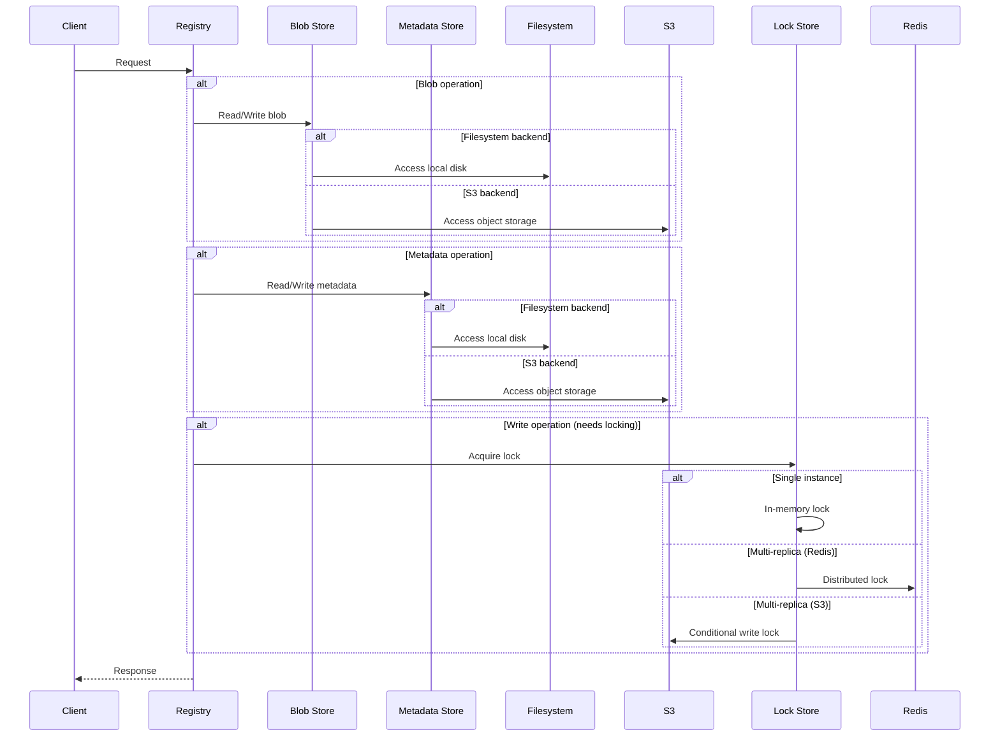
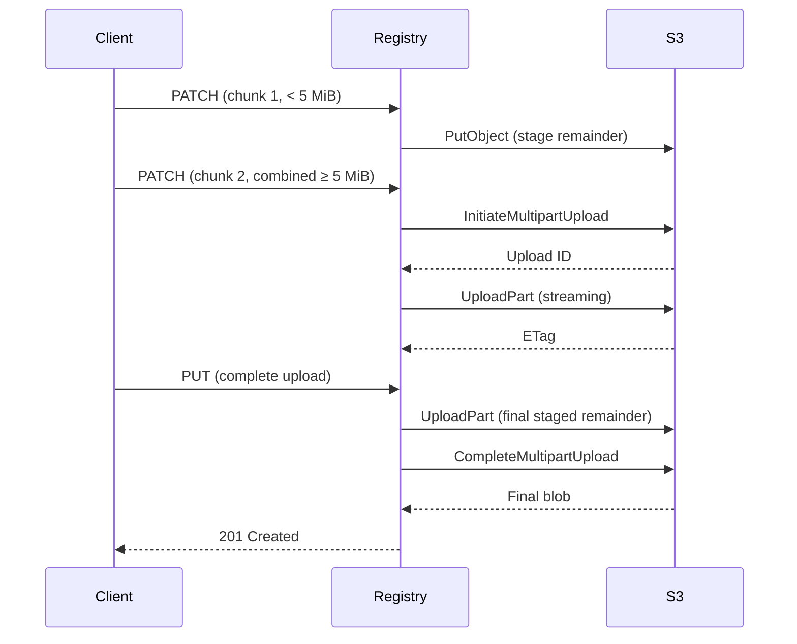
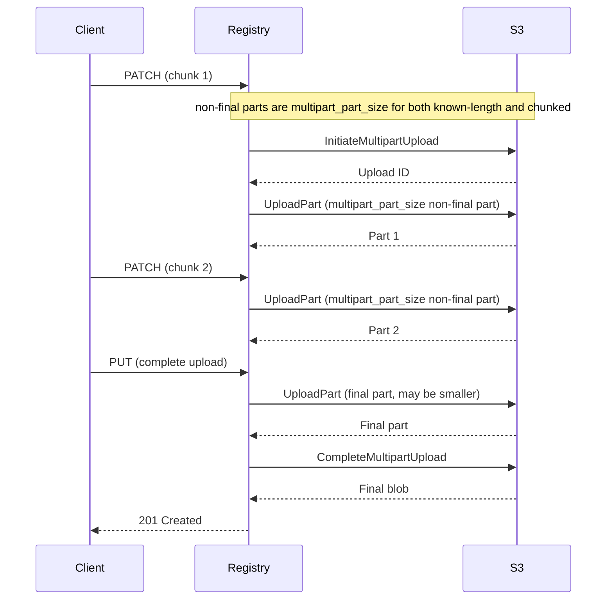

# Storage Backends

Angos supports two storage backends: filesystem and S3-compatible object storage.
This document explains when to use each and their trade-offs.

## Overview



---

## Blob Store vs Metadata Store

Angos separates storage into two logical stores:

| Store              | Contents                                | Size       | Access Pattern          |
|--------------------|-----------------------------------------|------------|-------------------------|
| **Blob Store**     | Layers, configs, manifest bodies        | Large (GB) | Sequential read/write   |
| **Metadata Store** | Manifest links, tags, blob-index shards | Small (KB) | Random access, frequent |

By default, both use the same backend. You can configure them independently:

```toml
# Both filesystem
[blob_store.fs]
root_dir = "/data/blobs"

[metadata_store.fs]
root_dir = "/data/metadata"
```

```toml
# Or split: blobs on S3, metadata on filesystem
[blob_store.s3]
bucket = "registry-blobs"
# ...

[metadata_store.fs]
root_dir = "/data/metadata"
```

---

## Filesystem Backend

### When to Use

- Single-instance deployments
- Development and testing
- When S3 is not available
- Low-latency requirements

### Configuration

```toml
[blob_store.fs]
root_dir = "/var/registry/data"
sync_to_disk = false  # Set true for durability

[metadata_store.fs]
root_dir = "/var/registry/data"  # Can be same as blob store
```

### Trade-offs

**Advantages:**
- Simple setup
- Low latency
- No external dependencies
- Cost-effective for small deployments

**Disadvantages:**
- Single-instance only: no multi-replica support without a shared storage
- No built-in redundancy or high availability
- Shared filesystem (NFS, EFS) not recommended for production (see below)

### Durability Options

```toml
[blob_store.fs]
root_dir = "/data"
sync_to_disk = true  # fsync after writes
```

- `sync_to_disk = true`: Every write is flushed to disk with `fsync()`, guaranteeing durability at the cost of higher write latency.
- `sync_to_disk = false` (default): Relies on OS page cache for better performance. Acceptable when the underlying storage already provides durability guarantees (e.g., battery-backed RAID, ZFS, cloud block storage with replication). Without such guarantees, data may be lost on crash or power failure.

---

## S3 Backend

### When to Use

- Multi-replica deployments
- High availability requirements
- Large storage needs
- Cloud-native infrastructure

### Configuration

```toml
[blob_store.s3]
access_key_id = "AKIA..."
secret_key = "..."
endpoint = "https://s3.amazonaws.com"
bucket = "my-registry"
region = "us-east-1"
key_prefix = "blobs/"  # Optional

# Multipart settings
multipart_part_size = "50MiB"
multipart_copy_threshold = "5GB"
multipart_copy_chunk_size = "100MB"
multipart_copy_jobs = 4

# Reliability settings
max_attempts = 3
operation_timeout_secs = 900
operation_attempt_timeout_secs = 300
```

### Trade-offs

**Advantages:**
- Unlimited scalability
- Built-in redundancy
- Multi-replica support
- Pay-per-use pricing

**Disadvantages:**
- Higher latency than local disk
- Network dependency
- Potential egress costs
- Requires distributed locking configuration for multi-replica

### Compatible Services

- AWS S3
- Exoscale SOS
- DigitalOcean Spaces
- Backblaze B2
- Cloudflare R2
- Any S3-compatible storage

---

## Multi-Replica Deployments

For multiple registry instances, you need:
1. **Shared storage**: S3 or shared filesystem
2. **Distributed locking**: Redis or S3

### With S3 Locking (Simplest)

The S3 lock strategy activates the CAS coordinator, which uses S3 conditional requests for all coordination, no extra infrastructure being required. It is the default on S3 metadata stores: with `lock_strategy` unset, Angos probes the provider at startup and uses it whenever the full conditional set is supported: `PutObject` with `If-None-Match: *`, `PutObject` with `If-Match`, and `DeleteObject` with `If-Match`. Selecting it explicitly makes startup fail fast if any of them is missing. Setting `conditional_operations = true|false` in `[metadata_store.s3]` declares support explicitly and skips the startup probe; `false` also pins the unset-lock default to the in-process memory lock. Conditional deletes make lock release and lock reclaim race-free: an instance can only ever remove its own lock object.

```toml
[blob_store.s3]
bucket = "registry-data"
# ... S3 config

[metadata_store.s3]
bucket = "registry-data"
# ... S3 config
```

The `lock_strategy.s3` block lets you tune internal lock timing parameters but is not required to enable CAS coordination; it activates automatically when the provider supports it:

```toml
[metadata_store.s3.lock_strategy.s3]
ttl_secs = 30          # Lock expiry (default: 30)
max_retries = 100      # Acquisition attempts (default: 100)
retry_delay_ms = 50    # Delay between retries (default: 50)
```

### With S3 + Redis

Selecting `lock_strategy = "redis"` makes Redis the lock-object backend. When the S3 provider supports conditional operations, the CAS executor still coordinates every metadata write; Redis supplies only the lock objects. Coordination routes through locks only when conditional operations are unavailable or disabled: set `conditional_operations = false` in `[metadata_store.s3]` to force that.

```toml
[blob_store.s3]
bucket = "registry-data"
# ... S3 config

[metadata_store.s3]
bucket = "registry-data"
# ... S3 config

[metadata_store.s3.lock_strategy.redis]
url = "redis://redis:6379"
ttl = 10
key_prefix = "registry-locks"

[cache.redis]
url = "redis://redis:6379"
key_prefix = "angos"
```

---

## Locking Behavior

The lock is held during:
- Manifest writes (tag updates)
- Blob link creation
- Upload completion

### In-Memory Locking

- Default for filesystem metadata stores and for S3 providers without conditional-operation support
- Only safe for single-instance deployments
- No coordination between replicas

### Redis Locking

Suitable for multi-replica with any storage backend:

```toml
[metadata_store.fs.lock_strategy.redis]
url = "redis://redis:6379"
ttl = 10                    # Lock timeout in seconds
key_prefix = "locks"        # Optional prefix
max_retries = 100           # Retry attempts
retry_delay_ms = 10         # Initial retry delay; retries back off up to 1s with jitter
```

### S3 Locking

Available only when using S3 for metadata (not supported with filesystem metadata stores), and the default there when the provider supports the full conditional set. Uses conditional writes (`If-None-Match: *`) to implement distributed locks directly in the S3 bucket, eliminating the need for Redis. Stale locks are automatically recovered after TTL expiry.

Lock operations use a dedicated S3 client with independent timeout configuration, separate from the metadata store's main S3 client. This allows tuning lock behavior independently: lock operations should fail fast rather than blocking for minutes, which is important in high-latency S3 scenarios.

```toml
[metadata_store.s3.lock_strategy.s3]
ttl_secs = 30               # Lock expiry in seconds (minimum: 9)
max_retries = 100           # Acquisition retry attempts
retry_delay_ms = 50         # Delay between retries (minimum: 1)
```

The heartbeat interval is automatically calculated as `ttl_secs / 3`. For example, with the default `ttl_secs = 30`, heartbeats occur every 10 seconds. The minimum `ttl_secs` value is 9 seconds, resulting in a minimum heartbeat interval of 3 seconds. Transient heartbeat failures (connect errors, refresh timeouts) accumulate up to a small budget (one heartbeat tick short of the TTL, so the lease is dropped while still valid) before cancelling the in-flight operation, so a short network blip does not kill in-progress work. Authoritative signals (ownership loss, max-hold expiry, missing lock object) cancel immediately.

:::note
The S3 provider must support conditional writes and conditional deletes. Angos probes for this capability at startup: an explicit `lock_strategy.s3` fails fast when any operation is missing, while an unset lock strategy falls back to the in-process memory lock. Setting `conditional_operations = true|false` declares support explicitly and skips the probe; `false` also pins the unset-lock default to the memory lock.
Known providers that support the full conditional set: AWS S3, Exoscale SOS
:::

If your S3 provider does not support them, use Redis locking instead:

```toml
[metadata_store.s3.lock_strategy.redis]
url = "redis://redis:6379"
ttl = 10
key_prefix = "registry-locks"
```

---

### Shared Filesystem (Not Recommended)

Shared filesystems (NFS, EFS) defeat Angos's stateless design and are not recommended for production:

- **Lock handling**: Distributed locking on shared filesystems is error-prone
- **Performance tuning**: NFS requires careful tuning of cache coherency and lock protocols
- **Recovery**: Stale locks and crashed instances are hard to handle without explicit consensus mechanisms
- **Scaling issues**: Lock contention worsens as replicas increase

For multi-replica deployments, use S3 instead: it provides distributed locking natively via conditional writes, with no additional infrastructure.

### Monitoring Lock Operations

Lock operations emit Prometheus metrics for observability. Key metrics to monitor:

- `lock_acquisition_duration_ms`: Histogram of lock acquisition times (e.g., p99 > 500ms indicates S3 latency degradation)
- `lock_retries_total`: Counter of lock acquisition retries (e.g., rising rate indicates lock contention)
- `lock_invalidations_total{reason="heartbeat_failure"}`: Heartbeat failures that exhausted the retry budget (e.g., indicates connectivity issues between the registry and the lock store). The heartbeat path is backend-agnostic, so both S3 and Redis report `heartbeat_failure`.
- `lock_recoveries_total`: Counter of stale lock recovery attempts (e.g., indicates crashed instances)

For multi-instance deployments, alert on:
- **High `lock_retries_total` rate**: Rising retry rate during normal operation suggests lock contention and may indicate insufficient `max_retries` or `retry_delay_ms` tuning.
- **`lock_invalidations_total{reason="heartbeat_failure"}`**: Heartbeat-side failures suggest network or backend issues between the registry and the lock store. Consider checking connectivity, network quality, and lock timeout settings. Heartbeat failures must accumulate past a budget (one heartbeat tick short of the TTL) before the in-flight operation is cancelled, so an isolated blip is absorbed rather than surfaced here.
- **High `lock_acquisition_duration_ms` p99**: Persistent p99 latency > expected S3 latency may indicate saturation or regional latency issues.

See the [configuration reference](../reference/configuration.md#prometheus-metrics) for the full metrics list.


---

## Blob Upload Modes (S3)

The registry supports two modes for uploading blobs to S3. By default, it uses the **non-uniform upload mode**, which is faster and works with most S3 providers. If your S3 provider requires uniform part sizes, switch to **uniform upload mode**.

### Non-Uniform Upload Mode (Default)

This is the recommended mode for most deployments. Each OCI `PATCH` request streams directly to S3:



Configuration:

```toml
[blob_store.s3]
multipart_uniform_parts = false  # Default
```

A `PATCH` that carries a `Content-Length` header streams toward S3 with that known length, frame-by-frame without buffering the whole chunk. A chunked `PATCH` with no `Content-Length` (sent by `docker push`) is streamed to EOF. When `multipart_part_size` is above the 5 MiB floor, it is coalesced server-side into `part_size` parts via `UploadPartCopy`: each part is assembled in a scratch multipart of 5 MiB sub-parts, then grafted into the main upload. At most one 5 MiB sub-part is held in memory, and each byte is moved twice within S3. When `multipart_part_size` is exactly 5 MiB, the chunked `PATCH` streams plain 5 MiB parts directly with no coalescing. In all cases the multipart upload is opened **lazily**: bytes below the 5 MiB S3 minimum are parked at a per-session staging key and combined with the next `PATCH`, so a multipart session is created only once there are enough bytes to flush a part of at least 5 MiB. An upload whose total never reaches 5 MiB skips multipart entirely: `complete` promotes the staged object to the upload key with a single `CopyObject`.

**Memory usage:** on the known-length path bytes stream frame-by-frame, so memory is essentially constant regardless of blob size; a coalesced chunked `PATCH` (`multipart_part_size` above the 5 MiB floor) buffers at most one 5 MiB sub-part at a time while coalescing into `part_size` parts. The only other buffered data is the sub-part remainder (< 5 MiB), which is parked in S3 between `PATCH` calls and re-read when the next chunk arrives.

### Uniform Upload Mode

If your S3 provider strictly enforces uniform non-final part sizes and rejects uploads with variable part sizes, enable uniform mode:



Configuration:

```toml
[blob_store.s3]
multipart_uniform_parts = true
multipart_part_size = "50MiB"
```

In this mode the multipart upload is opened on the first full part and maintained across the remaining `PATCH` requests. Both a known-length `PATCH` and a chunked `PATCH` (no `Content-Length`, as `docker push` sends) commit non-final parts of exactly `multipart_part_size` bytes; the final part may be smaller, which is what strict providers require.

**Memory usage:** full parts stream to S3 in small read frames; only the trailing sub-part remainder (smaller than `multipart_part_size`) is staged in S3 between calls. A chunked `PATCH` buffers up to one `multipart_part_size` part, the same as the known-length remainder.

### Related Configuration

```toml
[blob_store.s3]
# Part size (multipart assembly threshold)
multipart_part_size = "50MiB"

# Blobs larger than this use multipart copy
multipart_copy_threshold = "5GB"

# Size of each server-side copy part
multipart_copy_chunk_size = "100MB"

# Concurrent server-side copy operations
multipart_copy_jobs = 4
```

During S3 upload completion, Angos copies the assembled upload object into the
content-addressed blob path. Objects at or below `multipart_copy_threshold` use a
single S3 `CopyObject`; larger objects use S3 multipart copy with ranged
`UploadPartCopy` requests. This keeps large blob completion inside S3's supported
copy limits without proxying blob bytes through Angos.

---

## Performance Considerations

### Filesystem

- **SSD vs HDD**: SSD recommended for metadata
- **RAID**: Consider RAID for redundancy
- **Filesystem**: ext4 or XFS recommended

### S3

**Connectivity:**
- **Region**: Minimize latency with nearby region
- **VPC Endpoint**: Reduce costs and latency by avoiding internet gateway

**Multipart Upload:**
- **Part size** (`multipart_part_size`, default 50 MiB): Larger parts reduce S3 requests. Uniform mode streams full parts and only buffers the trailing staged chunk.
- **Uniform parts** (`multipart_uniform_parts`, default false): Set to `true` only if your S3 provider strictly requires uniform non-final part sizes.

**Timeout Configuration:**
- **`operation_timeout_secs`** (default 900s): Total time allowed for the entire operation (e.g., upload or copy)
- **`operation_attempt_timeout_secs`** (default 300s): Timeout per individual HTTP request attempt
- Set `operation_attempt_timeout_secs` high enough to tolerate your worst-case S3 latency, but not so high that failed requests block indefinitely

**Retry Strategy:**
- **`max_attempts`** (default 3): Number of times to retry a failed request
- Retries wait an exponential, jittered backoff (50ms doubling to a 1s ceiling) so a throttled bucket is not hammered
- Increase for unreliable networks, decrease if timeouts are common

### S3 Metadata Optimizations

When using S3 for metadata, Angos includes several optimizations to reduce round-trips and improve scalability:

**Link cache**: A read-through cache for link metadata (tags, layer links). Populated on both read and write, invalidated on delete. Configurable TTL (default 30 s, `link_cache_ttl = 0` to disable). Shares the same cache backend (in-memory or Redis) as authentication tokens.

In single-instance deployments, in-memory cache is sufficient. In multi-instance deployments, each instance maintains its own in-memory cache, so a write on instance A is not visible to instance B until the TTL expires. For consistency, use a shared Redis cache: when instance A writes a tag, all instances see the updated entry immediately.

**Access time updates**: With CAS coordination, every recording pull stamps the access time inline: one read plus one conditional write, and a stamp losing the race to a concurrent writer is a no-op. No buffering is involved and `access_time_debounce_secs` is ignored.

Without CAS, a synchronous stamp would be a lock-read-write-unlock cycle on every manifest pull, so access time updates are instead buffered in memory and flushed periodically. Configurable interval (default 60 s, `access_time_debounce_secs = 0` to disable). This reduces the critical path per pull from 4 S3 operations to 1. In multi-instance deployments, each instance maintains its own buffer, so access times may lag behind actual pulls and can be overwritten by concurrent instances (last writer wins).

```toml
[metadata_store.s3]
# ... S3 connection options
link_cache_ttl = 30               # seconds (0 to disable)
access_time_debounce_secs = 60    # seconds (0 to disable)
```

For retention policies that use `last_pulled_at`, set thresholds in **days rather than minutes** to account for buffering lag:

```toml
# Safe: keep images pulled within 30 days; the threshold tolerates access time imprecision
[global.retention_policy]
rules = ["image.last_pulled_at > now() - days(30)"]
```

On lock-coordinated deployments (no CAS), **never set `access_time_debounce_secs = 0`** in production. This disables buffering and causes every manifest pull to acquire and release a lock, which is expensive. Use the default 60 seconds or higher.

**Note on `lock_strategy = "redis"`:** Redis coordinates access-time writes only when the provider's conditional operations are unavailable or disabled (`conditional_operations = false`); with CAS available, access times stamp inline through conditional writes regardless of the lock strategy. `lock_strategy = "redis"` remains the right choice when running multi-replica on a provider that lacks conditional writes, or when Redis is already deployed for other reasons.

#### Blob Index Sharding

Blob indexes track which namespaces reference each blob and are critical for garbage collection. Rather than storing a single `index.json` per blob (which becomes a contention point under concurrent access), Angos uses a **sharded approach**:

Each blob's index is stored as multiple per-namespace files at:

```
v2/blobs/{algorithm}/{hash_prefix}/{hash}/refs/{namespace}.json
```

For example, a blob referenced by namespaces `myapp` and `team/backend` stores:

```
v2/blobs/sha256/ab/cdef.../refs/myapp.json
v2/blobs/sha256/ab/cdef.../refs/team%2Fbackend.json
```

The namespace is percent-encoded in the filename (`/` → `%2F`, `%` → `%25`) to avoid ambiguity.

Blob indexes separate metadata cleanup from blob data deletion. Manifest deletion removes manifest
links and may reclaim the manifest body itself, but config and layer blobs are retained while they
are still owned by a namespace. Explicit blob deletion refuses digests that are still referenced by
manifests; once the remaining references are gone, the final delete removes the shared blob data.

**Benefits:**

- **Reduced contention**: Multiple namespaces can update their blob references concurrently without serializing on a single file.
- **Faster updates**: Each shard is small, making updates quicker.
- **Scalability**: Performance doesn't degrade as the number of namespaces grows.

#### Namespace Catalog

Listing all namespaces (`_catalog` / `list_namespaces`) is derived directly from stored content with no maintained index. The catalog is built by walking the repository tree and yielding a path exactly when it has a `_manifests` child, which means the namespace holds at least one revision or tag. Paths that hold only non-manifest data (for example an in-progress `_uploads` session) are not catalog entries, and `_`-prefixed children are never descended into.

This makes the catalog **deterministic and strongly consistent**: a namespace appears the instant its first revision or tag is written and disappears the instant the last one is deleted. There is no namespace "registration" concept, no eventually-consistent index to converge, and no scrub step involved.

#### Legacy Layouts

Blob references live only in the sharded `refs/{namespace}.json` layout; the pre-1.2.0 single-file `index.json` is no longer read (see the [upgrade guide](../how-to/upgrade.md) for the required pre-upgrade migration).

Pre-existing namespace-registry index objects (`_registry/namespaces.json` and `_registry/ns/*.json`) written by earlier versions are no longer read or written; the catalog is now derived directly from stored content. These objects become unused after upgrade and can be left in place or deleted manually; no migration step is required.

#### Blob Index Convergence

The blob index is the cross-namespace map of which namespaces reference each
blob. It is stored per-blob, sharded by namespace under
`v2/blobs/<algo>/<prefix>/<hash>/refs/<safe_ns>.json`.

The write path adds entries on push and removes them on successful delete.
Mid-flight failures or out-of-band edits can leave stale entries pointing to
namespaces that no longer exist.

Periodic `angos scrub` probes every blob-index entry against its raw link key
in the metadata store, bypassing the link cache so a stale cache entry cannot
mask a repair. Entries whose link file is confirmed missing are removed, and a
shard whose entries all disappear is itself deleted. This convergence is part
of every scrub run. Entries that reference a blob whose backing bytes are
absent are left alone: they usually belong to an in-flight upload or a
lazily filled pull-through cache entry.

Blob ownership markers (`LinkKind::Blob`) are intentionally retained until the
client issues an explicit `DELETE /v2/<name>/blobs/<digest>`. They are not
removed when a namespace's manifests are deleted. Reclaiming byteless entries
is the job of `angos prune`, which purges them once the shard exceeds an age
window; ownership grants with no manifest reference are likewise reclaimed by
prune under the retention policies.

### Caching

Token and key caching reduces external requests:

```toml
[cache.redis]
url = "redis://redis:6379"
key_prefix = "cache"
```

Without Redis, cache is in-memory per-instance.

---

## Migration

### Filesystem to S3

1. Stop the registry
2. Copy data to S3:
   ```bash
   aws s3 sync /data/registry s3://my-bucket/
   ```
3. Update configuration
4. Start the registry

### S3 to Filesystem

1. Stop the registry
2. Download data:
   ```bash
   aws s3 sync s3://my-bucket/ /data/registry/
   ```
3. Update configuration
4. Start the registry

---

## Decision Matrix

| Requirement        | Filesystem     | S3              |
|--------------------|----------------|-----------------|
| Single instance    | ✅             | ✅               |
| Multiple instances | ❌              | ✅               |
| High availability  | ❌             | ✅               |
| Low latency        | ✅             | ❌               |
| Native locking     | ✅ (in-memory) | ✅ (S3 or Redis) |
| Simple setup       | ✅             | ❌               |
| Cost (small scale) | ✅             | ❌               |
| Cost (large scale) | ❌             | ✅               |
| Unlimited storage  | ❌             | ✅               |

## Transactional Engine

The transactional engine consolidates multi-step metadata writes behind single atomic `Transaction` objects. It runs on the metadata store, whose `Store` the job store shares; the blob store is pure storage and hosts no engine. Blob-byte writes are content-addressed and idempotent, serialized where needed by a `blob-data:{digest}` coarse lock taken on the metadata engine, the single lock domain every blob-data participant shares. The coordinated write paths are:

| Subsystem | Description |
|---|---|
| Metadata store | `MetadataStore::update_links`: link writes plus idempotent blob-index shard merges submitted as one transaction. |
| Job store | `JobStore::enqueue`, `JobStore::complete`, and `JobStore::fail`: lock release and pending/index deletes commit atomically as one transaction on the metadata store's engine. |
| Upload store | Blob upload sessions persisted as per-file artifacts under `v2/repositories/<namespace>/_uploads/<uuid>/` (`session`, `startedat`, `hashstates/sha256/<offset>`, `data`); `complete` moves the staged blob to its content-addressed key and clears the session-record files as idempotent effects under the `blob-data:{digest}` lock. A crash mid-promotion leaves a re-drivable state that the caller's retry or scrub reconciles. |
| Manifest store | `Registry::store_manifest` writes the manifest body to the blob store, then commits its link and blob-index mutations as one transaction under the `blob-data:{digest}` lock; `Registry::delete_manifest` reclaims the body after the link transaction reports it unreferenced. A crash between the body write and the links leaves at most an orphan blob, which scrub reclaims. |

Blob-index shards are the one hot key that many concurrent pushes contend on, so their mutations are idempotent set-merges carrying an add/remove delta rather than a whole-body overwrite. The shard still joins the read set, so a concurrent write is caught at prepare and the transaction retries cleanly on the fast path; if a write slips in after the commit point, the merge re-reads the live shard and re-applies the delta on replay instead of leaving a committed transaction with a permanently unsatisfiable precondition. The `blob-data:{digest}` coarse lock continues to isolate the delete path's unreferenced check.

The CAS-vs-Lock executor choice happens once inside the engine factory based on the configured `lock_strategy` and detected S3 capabilities; subsystems never see it. The on-disk key layout is unchanged from a non-transactional deployment.

The engine keeps three reserved prefixes in the metadata store's backend: `.tx-log/` holds the transaction journal, `.tx-bodies/` holds staged object bodies, and `.tx-locks/` holds lock objects. The blob store's backend carries none of them. Recovery runs automatically and needs no operator configuration. Every server and worker replica runs a recovery loop that completes or rolls back any transaction interrupted by a crash, sweeping every 30 seconds. A body janitor reaps orphaned staged bodies under `.tx-bodies/` once they exceed a TTL, and a lock janitor reclaims cold lock objects under `.tx-locks/` once they exceed their TTL plus a grace period (a lock object whose body no longer parses states no TTL, so it is aged by its object mtime against the longest permitted TTL instead, which is what keeps a corrupt one from blocking its key for good). Both janitors run as part of every `angos scrub`, not as background loops in the serving processes, so schedule scrub periodically or staging and lock garbage is never reclaimed.

A committed transaction whose remaining mutation cannot be reconciled is normally transient and clears on a later sweep. If one stays unreconcilable past a one-hour grace (an intent whose mutation cannot converge because its target diverged permanently), the recovery loop abandons it: it reaps the intent with an escalated warning rather than replaying it every sweep forever. The derived blob-index state is reconciled by `angos scrub`, so abandonment loses nothing a stuck replay would have recovered.
