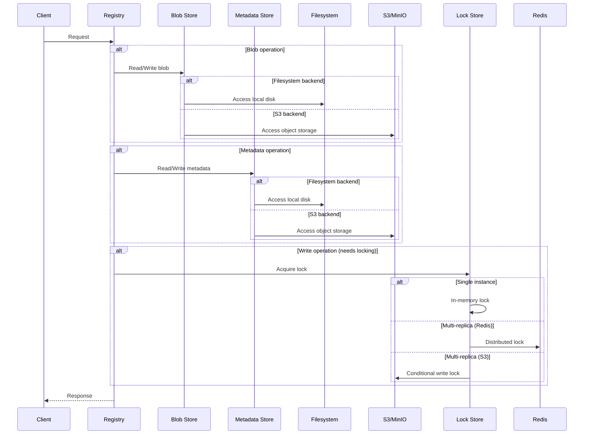
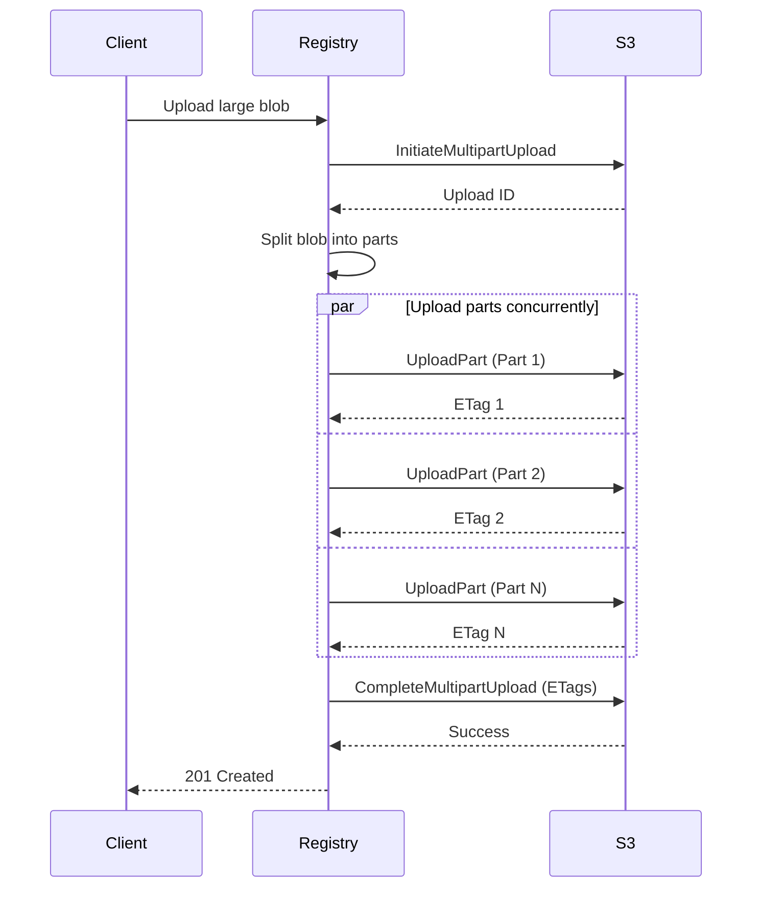

# Storage Backends

Angos supports two storage backends: filesystem and S3-compatible object storage.
This document explains when to use each and their trade-offs.

## Overview



---

## Blob Store vs Metadata Store

Angos separates storage into two logical stores:

| Store              | Contents               | Size       | Access Pattern          |
|--------------------|------------------------|------------|-------------------------|
| **Blob Store**     | Layer data, configs    | Large (GB) | Sequential read/write   |
| **Metadata Store** | Manifests, tags, links | Small (KB) | Random access, frequent |

By default, both use the same backend. You can configure them independently:

```toml
# Both filesystem
[blob_store.fs]
root_dir = "/data/blobs"

[metadata_store.fs]
root_dir = "/data/metadata"
```

```toml
# Or split: blobs on S3, metadata on filesystem
[blob_store.s3]
bucket = "registry-blobs"
# ...

[metadata_store.fs]
root_dir = "/data/metadata"
```

---

## Filesystem Backend

### When to Use

- Single-instance deployments
- Development and testing
- When S3 is not available
- Low-latency requirements

### Configuration

```toml
[blob_store.fs]
root_dir = "/var/registry/data"
sync_to_disk = false  # Set true for durability

[metadata_store.fs]
root_dir = "/var/registry/data"  # Can be same as blob store
```

### Trade-offs

**Advantages:**
- Simple setup
- Low latency
- No external dependencies
- Cost-effective for small deployments

**Disadvantages:**
- Limited to single node (without shared filesystem)
- Scaling requires shared storage (NFS, EFS)
- No built-in redundancy

### Durability Options

```toml
[blob_store.fs]
root_dir = "/data"
sync_to_disk = true  # fsync after writes
```

- `sync_to_disk = false`: Faster, relies on OS buffering
- `sync_to_disk = true`: Slower, guaranteed durability

---

## S3 Backend

### When to Use

- Multi-replica deployments
- High availability requirements
- Large storage needs
- Cloud-native infrastructure

### Configuration

```toml
[blob_store.s3]
access_key_id = "AKIA..."
secret_key = "..."
endpoint = "https://s3.amazonaws.com"
bucket = "my-registry"
region = "us-east-1"
key_prefix = "blobs/"  # Optional

# Multipart settings
multipart_part_size = "50MiB"
multipart_copy_threshold = "5GB"
multipart_copy_chunk_size = "100MB"
multipart_copy_jobs = 4

# Reliability settings
max_attempts = 3
operation_timeout_secs = 900
operation_attempt_timeout_secs = 300
```

### Trade-offs

**Advantages:**
- Unlimited scalability
- Built-in redundancy
- Multi-replica support
- Pay-per-use pricing

**Disadvantages:**
- Higher latency than local disk
- Network dependency
- Potential egress costs
- Requires distributed locking configuration for multi-replica

### Compatible Services

- AWS S3
- MinIO
- Exoscale SOS
- DigitalOcean Spaces
- Backblaze B2
- Cloudflare R2
- Any S3-compatible storage

---

## Multi-Replica Deployments

For multiple registry instances, you need:
1. **Shared storage**: S3 or shared filesystem
2. **Distributed locking**: Redis or S3

### With S3 Locking (Simplest)

Uses S3 conditional writes (`If-None-Match: *`) for locking — no extra infrastructure required. The S3 provider must support conditional writes; Angos verifies this at startup.

```toml
[blob_store.s3]
bucket = "registry-data"
# ... S3 config

[metadata_store.s3]
bucket = "registry-data"
# ... S3 config
```

To customize lock behavior:

```toml
[metadata_store.s3.lock_strategy.s3]
ttl_secs = 30          # Lock expiry (default: 30)
max_retries = 100      # Acquisition attempts (default: 100)
retry_delay_ms = 50    # Delay between retries (default: 50)
```

### With S3 + Redis

```toml
[blob_store.s3]
bucket = "registry-data"
# ... S3 config

[metadata_store.s3]
bucket = "registry-data"
# ... S3 config

[metadata_store.s3.lock_strategy.redis]
url = "redis://redis:6379"
ttl = 10
key_prefix = "registry-locks"

[cache.redis]
url = "redis://redis:6379"
```

### With Shared Filesystem + Redis

```toml
[blob_store.fs]
root_dir = "/mnt/nfs/registry"

[metadata_store.fs]
root_dir = "/mnt/nfs/registry"

[metadata_store.fs.lock_strategy.redis]
url = "redis://redis:6379"
ttl = 10

[cache.redis]
url = "redis://redis:6379"
```

---

## Locking Behavior

### In-Memory Locking (Default)

- Used when Redis is not configured
- Only safe for single-instance deployments
- No coordination between replicas

### Redis Locking

Suitable for multi-replica with any storage backend:

```toml
[metadata_store.fs.lock_strategy.redis]
url = "redis://redis:6379"
ttl = 10                    # Lock timeout in seconds
key_prefix = "locks"        # Optional prefix
max_retries = 100           # Retry attempts
retry_delay_ms = 10         # Delay between retries
```

**Legacy form:** The `[metadata_store.*.redis]` table (e.g., `[metadata_store.fs.redis]`) is still accepted for backward compatibility and is equivalent to `[metadata_store.*.lock_strategy.redis]`. New configurations should use the `lock_strategy` form.

### S3 Locking

Available only when using S3 for metadata (not supported with filesystem metadata stores). Uses conditional writes (`If-None-Match: *`) to implement distributed locks directly in the S3 bucket, eliminating the need for Redis. Stale locks are automatically recovered after TTL expiry.

Lock operations use a dedicated S3 client with independent timeout configuration, separate from the metadata store's main S3 client. This allows tuning lock behavior independently — lock operations should fail fast rather than blocking for minutes, which is important in high-latency S3 scenarios.

```toml
[metadata_store.s3.lock_strategy.s3]
ttl_secs = 30               # Lock expiry in seconds (minimum: 9)
max_retries = 100           # Acquisition retry attempts
retry_delay_ms = 50         # Delay between retries (minimum: 1)
```

The heartbeat interval is automatically calculated as `ttl_secs / 3`. For example, with the default `ttl_secs = 30`, heartbeats occur every 10 seconds. The minimum `ttl_secs` value is 9 seconds, resulting in a minimum heartbeat interval of 3 seconds.

:::note
The S3 provider must support conditional writes. Angos probes for this capability at startup and fails fast if it is not available.
:::

Lock is held during:
- Manifest writes (tag updates)
- Blob link creation
- Upload completion

### Monitoring Lock Operations

Lock operations emit Prometheus metrics for observability. Key metrics to monitor:

- `lock_acquisition_duration_ms` — Histogram of lock acquisition times (e.g., p99 > 500ms indicates S3 latency degradation)
- `lock_retries_total` — Counter of lock acquisition retries (e.g., rising rate indicates lock contention)
- `lock_invalidations_total{reason="heartbeat_failure"}` — Stale heartbeat failures (e.g., indicates S3 connectivity issues)
- `lock_recoveries_total` — Counter of stale lock recovery attempts (e.g., indicates crashed instances)

For multi-instance deployments, alert on:
- **High `lock_retries_total` rate**: Rising retry rate during normal operation suggests lock contention and may indicate insufficient `max_retries` or `retry_delay_ms` tuning.
- **`lock_invalidations_total{reason="heartbeat_failure"}`**: Heartbeat failures suggest network issues between the registry and S3. Consider checking S3 connectivity, network quality, and lock timeout settings.
- **High `lock_acquisition_duration_ms` p99**: Persistent p99 latency > expected S3 latency may indicate saturation or regional latency issues.

See the [configuration reference](../reference/configuration.md#prometheus-metrics) for the full metrics list.

---

## Multi-Instance Consistency

When multiple Angos instances share an S3 metadata backend, locking guarantees write safety but caching introduces read consistency trade-offs. This section covers what to expect and how to tune for your requirements.

### Cache Modes

By default, Angos caches link metadata (tags, layer links) in memory. Each instance maintains its own cache, so a write on instance A is not visible to instance B until the cache entry expires or is evicted. The `link_cache_ttl` setting (default 30 s) controls how long stale entries persist.

**Option 1: Redis cache (recommended for multi-instance)**

A shared Redis cache eliminates cross-instance staleness. When instance A writes a tag, instance B sees the updated cache entry immediately because both share the same Redis-backed store.

```toml
[blob_store.s3]
bucket = "my-registry"
endpoint = "https://s3.amazonaws.com"
region = "us-east-1"

[metadata_store.s3]
bucket = "my-registry"
endpoint = "https://s3.amazonaws.com"
region = "us-east-1"

[metadata_store.s3.lock_strategy.s3]

[cache.redis]
url = "redis://redis:6379"
```

**Option 2: Reduced TTL (no Redis required)**

If adding Redis is not practical, reduce `link_cache_ttl` to shrink the staleness window. A lower TTL increases S3 read traffic but keeps all infrastructure in S3.

```toml
[blob_store.s3]
bucket = "my-registry"
endpoint = "https://s3.amazonaws.com"
region = "us-east-1"

[metadata_store.s3]
bucket = "my-registry"
endpoint = "https://s3.amazonaws.com"
region = "us-east-1"
link_cache_ttl = 5  # 5 seconds instead of 30

[metadata_store.s3.lock_strategy.s3]
```

Setting `link_cache_ttl = 0` disables the cache entirely and always reads from S3.

### S3 Lock Recovery

S3 locks use a TTL (default 30 seconds, minimum 3 seconds) with automatic heartbeat renewal at `ttl_secs / 3` intervals. Under normal operation the holder renews the lock before it expires. If an instance crashes while holding a lock, other instances must wait for the full TTL to elapse before the lock is recovered. You can tune this trade-off:

- **Lower `ttl_secs`** (e.g., 15): faster recovery after a crash, but more frequent heartbeat writes (at 5 s intervals).
- **Higher `ttl_secs`** (e.g., 60): fewer heartbeat writes (at 20 s intervals), but longer recovery time.

```toml
[metadata_store.s3.lock_strategy.s3]
ttl_secs = 15          # Faster crash recovery
max_retries = 100
retry_delay_ms = 50
```

### Access Times and Retention Policies

Access time updates (`last_pulled_at`) are buffered in memory and flushed to S3 every `access_time_debounce_secs` seconds (default 60). In a multi-instance deployment, each instance maintains its own buffer. This means:

- Access times may lag behind actual pulls by up to `access_time_debounce_secs`.
- If an instance crashes before flushing, those buffered updates are lost.
- Multiple instances may overwrite each other's access times (last writer wins).

> **S3 Lock Performance:** When using S3 lock strategy, setting `access_time_debounce_secs = 0` disables buffering and causes every manifest pull to perform a lock-acquire → read → write → release cycle. This is particularly expensive with S3 locking and should be avoided in production. Use the default debounce value (60s or higher) for S3-locked deployments.

For retention policies that use `last_pulled_at`, set thresholds in **days rather than minutes** to account for this imprecision. For example:

```toml
# Safe: 30-day threshold tolerates access time imprecision
[global.retention_policy]
rules = ["manifest.last_pulled_at < now() - days(30)"]
```

---

## Multipart Uploads (S3)

Large blobs use multipart uploads:



Configuration:

```toml
[blob_store.s3]
# Minimum part size (parts are at least this large)
multipart_part_size = "50MiB"

# Blobs larger than this use multipart copy
multipart_copy_threshold = "5GB"

# Size of each copy chunk
multipart_copy_chunk_size = "100MB"

# Concurrent copy operations
multipart_copy_jobs = 4
```

---

## Performance Considerations

### Filesystem

- **SSD vs HDD**: SSD recommended for metadata
- **RAID**: Consider RAID for redundancy
- **Filesystem**: ext4 or XFS recommended

### S3

- **Region**: Minimize latency with nearby region
- **VPC Endpoint**: Reduce costs and latency
- **Part Size**: Larger parts = fewer requests, more memory

### S3 Metadata Optimizations

When using S3 for metadata, Angos includes several optimizations to reduce round-trips and improve scalability:

**Link cache** — A read-through cache for link metadata (tags, layer links). Populated on both read and write, invalidated on delete. Configurable TTL (default 30 s, `link_cache_ttl = 0` to disable). Shares the same cache backend (in-memory or Redis) as authentication tokens.

**Deferred access time updates** — Instead of a synchronous lock-read-write-unlock cycle on every manifest pull, access time updates are buffered in memory and flushed periodically. Configurable interval (default 60 s, `access_time_debounce_secs = 0` to disable). This reduces the critical path per pull from 4 S3 operations to 1.

```toml
[metadata_store.s3]
# ... S3 connection options
link_cache_ttl = 30               # seconds (0 to disable)
access_time_debounce_secs = 60    # seconds (0 to disable)
```

#### Blob Index Sharding

Blob indexes track which namespaces reference each blob and are critical for garbage collection. Rather than storing a single `index.json` per blob (which becomes a contention point under concurrent access), Angos uses a **sharded approach**:

Each blob's index is stored as multiple per-namespace files at:

```
v2/blobs/{algorithm}/{hash_prefix}/{hash}/refs/{namespace}.json
```

For example, a blob referenced by namespaces `myapp` and `team/backend` stores:

```
v2/blobs/sha256/ab/cdef.../refs/myapp.json
v2/blobs/sha256/ab/cdef.../refs/team%2Fbackend.json
```

The namespace is percent-encoded in the filename (`/` → `%2F`, `%` → `%25`) to avoid ambiguity.

**Benefits:**

- **Reduced contention** — Multiple namespaces can update their blob references concurrently without serializing on a single file.
- **Faster updates** — Each shard is small, making updates quicker.
- **Scalability** — Performance doesn't degrade as the number of namespaces grows.

#### Namespace Registry

Listing all namespaces requires discovering all repositories and their nested namespaces. Without optimization, this is an O(n) tree walk across S3, which scales poorly.

Angos maintains an index at:

```
_registry/namespaces.json
```

This file contains a simple JSON list:

```json
{
  "namespaces": ["myapp", "team/backend", "team/frontend"]
}
```

The registry is:

- **Built on first use** — If missing, Angos performs an S3 tree walk to discover all namespaces and writes the registry file.
- **Updated incrementally** — New namespaces are appended to the registry as they are created.
- **Protected by locking** — Concurrent writes use distributed locking (S3 conditional writes or a lock key) to prevent corruption.

**Benefits:**

- **O(1) list performance** — Instead of O(n) tree walk, `list_namespaces` becomes a single file read.
- **No background jobs** — The registry is built on demand, not via a separate garbage collector or background process.

#### Legacy Blob Index Migration

Angos deployed before version v1.1.0 used a single `index.json` file per blob. This is automatically migrated to the sharded format on first read with no manual intervention:

1. Registry reads blob metadata and finds no sharded index files
2. Falls back to reading the legacy `v2/blobs/{algorithm}/{hash_prefix}/{hash}/index.json`
3. Writes each namespace's references to its own shard file
4. Deletes the legacy `index.json`
5. Subsequent reads use the sharded format

The migration is transparent and happens exactly once per blob. You can verify migration progress by monitoring S3 operations or checking logs for "Migrated legacy blob index" messages.

### Caching

Token and key caching reduces external requests:

```toml
[cache.redis]
url = "redis://redis:6379"
key_prefix = "cache"
```

Without Redis, cache is in-memory per-instance.

---

## Migration

### Filesystem to S3

1. Stop the registry
2. Copy data to S3:
   ```bash
   aws s3 sync /data/registry s3://my-bucket/
   ```
3. Update configuration
4. Start the registry

### S3 to Filesystem

1. Stop the registry
2. Download data:
   ```bash
   aws s3 sync s3://my-bucket/ /data/registry/
   ```
3. Update configuration
4. Start the registry

---

## Decision Matrix

| Requirement        | Filesystem     | S3              |
|--------------------|----------------|-----------------|
| Single instance    | ✅             | ✅               |
| Multiple instances | ❌ (needs NFS) | ✅               |
| High availability  | ❌             | ✅               |
| Low latency        | ✅             | ❌               |
| Native locking     | ✅ (in-memory) | ✅ (S3 or Redis) |
| Simple setup       | ✅             | ❌               |
| Cost (small scale) | ✅             | ❌               |
| Cost (large scale) | ❌             | ✅               |
| Unlimited storage  | ❌             | ✅               |
