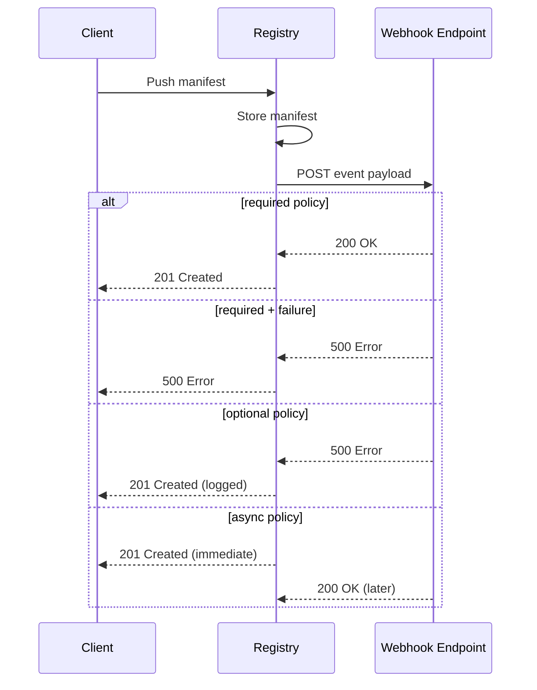

# Configure Event Webhooks

Notify external systems when registry events occur -- manifest pushes, blob uploads, tag operations, and more.

## Prerequisites

- Angos running
- External HTTP/HTTPS endpoint to receive events

## How Event Webhooks Work

1. Client performs a mutating operation (push, delete, tag)
2. Registry builds an event payload with operation details
3. Registry delivers the event to matching webhook endpoints
4. Delivery behavior depends on the configured policy



---

## Basic Configuration

### Define a Webhook

```toml
[event_webhook.notifications]
url = "https://hooks.example.com/registry"
policy = "optional"
events = ["manifest.push", "tag.create"]
```

### Enable Globally

```toml
[global]
event_webhooks = ["notifications"]
```

### Or Per-Repository

```toml
[repository."production"]
event_webhooks = ["notifications"]
```

---

## Delivery Policies

### Required -- Block on Failure

The registry waits for a successful response. If the webhook fails, the client operation fails too.

```toml
[event_webhook.audit]
url = "https://audit.example.com/events"
policy = "required"
events = ["manifest.push", "manifest.delete"]
timeout_ms = 3000
max_retries = 2
```

Use this when the external system must acknowledge the event before it is considered complete (e.g., audit logging, compliance).

### Optional -- Log on Failure

The registry waits for a response but does not fail the client operation if the webhook fails.

```toml
[event_webhook.monitoring]
url = "https://monitoring.example.com/events"
policy = "optional"
events = ["manifest.push", "blob.push", "tag.create"]
timeout_ms = 2000
max_retries = 1
```

Use this for best-effort notifications where delivery is important but not critical.

### Async -- Fire and Forget

The registry dispatches the event in the background and returns to the client immediately.

```toml
[event_webhook.analytics]
url = "https://analytics.example.com/ingest"
policy = "async"
events = ["manifest.push", "manifest.delete", "blob.push", "tag.create", "tag.delete"]
```

Use this when latency matters more than delivery guarantees (e.g., analytics, dashboards).

---

## Authentication

### Bearer Token with HMAC Signing

When a `token` is configured, the registry sends it as a Bearer token and signs the payload with HMAC-SHA256:

```toml
[event_webhook.secure]
url = "https://hooks.example.com/events"
policy = "optional"
token = "my-webhook-secret"
events = ["manifest.push"]
```

The registry sends these headers:

| Header                     | Value                          |
|----------------------------|--------------------------------|
| `Authorization`            | `Bearer my-webhook-secret`     |
| `X-Registry-Signature-256` | `sha256=<hmac-hex-digest>`     |
| `X-Registry-Event`         | Event type (e.g. `manifest.push`) |
| `Content-Type`             | `application/json`             |

---

## Verify HMAC Signatures

When you configure a `token`, verify the signature on your webhook endpoint to ensure the payload is authentic.

### Python

```python
import hashlib
import hmac

def verify_signature(secret: str, body: bytes, signature_header: str) -> bool:
    """Verify X-Registry-Signature-256 header."""
    if not signature_header.startswith("sha256="):
        return False

    expected = hmac.new(
        secret.encode(),
        body,
        hashlib.sha256
    ).hexdigest()

    received = signature_header[len("sha256="):]
    return hmac.compare_digest(expected, received)

# Usage in Flask:
from flask import Flask, request, abort

app = Flask(__name__)

@app.route('/events', methods=['POST'])
def handle_event():
    signature = request.headers.get('X-Registry-Signature-256', '')
    if not verify_signature('my-webhook-secret', request.data, signature):
        abort(401)

    event = request.json
    print(f"Received {event['kind']} for {event['namespace']}")
    return '', 200
```

### Go

```go
package main

import (
    "crypto/hmac"
    "crypto/sha256"
    "encoding/hex"
    "fmt"
    "strings"
)

func verifySignature(secret string, body []byte, signatureHeader string) bool {
    if !strings.HasPrefix(signatureHeader, "sha256=") {
        return false
    }

    mac := hmac.New(sha256.New, []byte(secret))
    mac.Write(body)
    expected := hex.EncodeToString(mac.Sum(nil))
    received := signatureHeader[len("sha256="):]

    return hmac.Equal([]byte(expected), []byte(received))
}
```

---

## Repository Filters

Scope webhooks to specific repositories using regex patterns:

```toml
[event_webhook.production-only]
url = "https://hooks.example.com/production"
policy = "required"
events = ["manifest.push", "manifest.delete"]
repository_filter = ["^production/.*"]
```

Multiple patterns are OR-matched (any pattern matching triggers delivery):

```toml
[event_webhook.important-repos]
url = "https://hooks.example.com/important"
policy = "optional"
events = ["manifest.push"]
repository_filter = ["^production/.*", "^staging/.*", "^library/.*"]
```

Without `repository_filter`, the webhook receives events from all repositories.

---

## Retry Behavior

For `required` and `optional` policies, retries use exponential backoff:

```
Attempt 1: immediate
Attempt 2: 100ms delay
Attempt 3: 200ms delay
Attempt 4: 400ms delay
...
```

Formula: `100ms * 2^(attempt - 1)`

```toml
[event_webhook.reliable]
url = "https://hooks.example.com/events"
policy = "required"
events = ["manifest.push"]
max_retries = 3       # Up to 3 retries after the initial attempt
timeout_ms = 5000     # Per-request timeout
```

---

## Multiple Webhooks

Configure different webhooks for different purposes:

```toml
# Audit log -- must succeed
[event_webhook.audit]
url = "https://audit.example.com/events"
policy = "required"
token = "audit-secret"
events = ["manifest.push", "manifest.delete"]
max_retries = 3

# Slack notifications -- best effort
[event_webhook.slack]
url = "https://hooks.slack.com/services/T.../B.../xxx"
policy = "optional"
events = ["manifest.push", "tag.create"]
timeout_ms = 3000

# Analytics -- fire and forget
[event_webhook.analytics]
url = "https://analytics.internal/ingest"
policy = "async"
events = ["manifest.push", "manifest.delete", "blob.push", "tag.create", "tag.delete"]

# Enable all globally
[global]
event_webhooks = ["audit", "slack", "analytics"]

# Production repos get audit only
[repository."production"]
event_webhooks = ["audit"]
```

---

## Hot Reloading

Event webhook configuration supports hot reloading. Changes to webhook definitions take effect without restarting the server:

- Adding new webhooks
- Removing webhooks
- Changing webhook URLs, tokens, policies, or filters

In-flight deliveries on the old configuration continue to completion.

---

## Graceful Shutdown

On `SIGTERM` or `SIGINT`, the registry drains in-flight async webhook deliveries before shutting down. Deliveries that exceed the shutdown timeout are logged and abandoned.

---

## Monitoring

Prometheus metrics for event webhooks:

```promql
# Delivery rate by webhook and result
sum by (webhook, result) (rate(event_webhook_deliveries_total[5m]))

# Error rate for a specific webhook
rate(event_webhook_deliveries_total{webhook="audit", result="error"}[5m])

# P95 delivery latency
histogram_quantile(0.95, rate(event_webhook_delivery_duration_seconds_bucket[5m]))

# Delivery latency by webhook
histogram_quantile(0.95, sum by (webhook, le) (rate(event_webhook_delivery_duration_seconds_bucket[5m])))
```

---

## Troubleshooting

**Webhook not receiving events:**
- Verify the webhook name is listed in `event_webhooks` (global or repository)
- Check that the event type is in the webhook's `events` list
- If using `repository_filter`, confirm the pattern matches the repository name

**Required webhook failing client operations:**
- Switch to `optional` policy while debugging
- Increase `timeout_ms` if the endpoint is slow
- Add `max_retries` for transient failures

**Events delayed or missing with async policy:**
- Async deliveries run in the background; check server logs for errors
- Verify the endpoint is healthy and responding

**Debug logging:**
```bash
RUST_LOG=angos::event_webhook=debug ./angos server
```

## Reference

- [Event Webhooks Reference](../reference/event-webhooks.md) - Configuration options and payload schema
- [Metrics Reference](../reference/metrics.md) - Webhook delivery metrics
