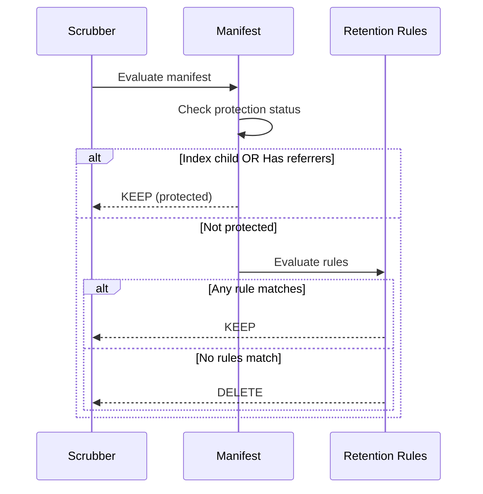

# Configure Retention Policies

Set up automated cleanup of old container images using CEL-based retention policies.

## Prerequisites

- Angos running
- `update_pull_time = true` if using pull-based retention

## How Retention Works

Retention policies define which images to **keep**. Images not matching any rule are eligible for deletion when running `angos prune`.



**Protected manifests** are never deleted:
- Child manifests of multi-platform indexes
- Manifests with referrers (signatures, SBOMs)

---

## Basic Configuration

### Global Policy

```toml
[global]
update_pull_time = true  # Required for pull-based retention

[global.retention_policy]
rules = [
  'image.tag == "latest"',
  'image.pushed_at > now() - days(30)'
]
```

### Repository Policy

```toml
[repository."production".retention_policy]
rules = [
  'image.tag == "latest"',
  'image.pushed_at > now() - days(90)',
  'top_pushed(20)'
]
```

---

## Common Patterns

### Keep Tagged, Delete Untagged

```toml
rules = [
  'image.tag != null'
]
```

### Time-Based Retention

```toml
rules = [
  'image.pushed_at > now() - days(30)',   # Keep 30 days
  'image.last_pulled_at > now() - days(7)' # Or pulled within 7 days
]
```

### Top-K Retention

```toml
rules = [
  'top_pushed(10)',  # Keep 10 most recently pushed
  'top_pulled(5)'    # Keep 5 most recently pulled
]
```

### Semantic Version Tags

```toml
rules = [
  'image.tag != null && image.tag.matches("^v?[0-9]+\\.[0-9]+\\.[0-9]+$")'
]
```

### Combined Rules

A manifest is **KEPT** if **ANY** rule matches (rules are OR'd):

```toml
rules = [
  # Always keep latest
  'image.tag == "latest"',

  # Keep release tags forever
  'image.tag != null && image.tag.matches("^v[0-9]+\\.[0-9]+\\.[0-9]+$")',

  # Keep other tags for 30 days
  'image.tag != null && image.pushed_at > now() - days(30)',

  # Keep untagged for 7 days
  'image.pushed_at > now() - days(7)',

  # Keep top 10 most pulled
  'top_pulled(10)'
]
```

**Rule Functions:**
- `top_pushed(n)` - Keep the n most recently pushed manifests
- `top_pulled(n)` - Keep the n most recently pulled manifests

---

## Environment-Specific Policies

### Development: Aggressive Cleanup

```toml
[repository."dev".retention_policy]
rules = [
  'image.tag == "latest"',
  'image.pushed_at > now() - days(7)',
  'top_pushed(5)'
]
```

### Staging: Moderate Retention

```toml
[repository."staging".retention_policy]
rules = [
  'image.tag == "latest"',
  'image.pushed_at > now() - days(14)',
  'top_pushed(10)'
]
```

### Production: Conservative

```toml
[repository."production".retention_policy]
rules = [
  'image.tag == "latest"',
  'image.pushed_at > now() - days(90)',
  'image.tag != null && image.tag.matches("^v[0-9]+\\.")',
  'top_pushed(50)'
]
```

---

## Global + Repository Policies

When both are defined, a manifest is kept if **either** policy matches:

```toml
# Global baseline: keep everything for at least 7 days
[global.retention_policy]
rules = [
  'image.pushed_at > now() - days(7)'
]

# Repo-specific: extend for production
[repository."production".retention_policy]
rules = [
  'image.pushed_at > now() - days(365)'
]
```

Result: Production images kept for 365 days, others for 7 days.

---

## Enforcing Retention Policies

Retention policies are enforced by the `prune` command (`scrub --retention` is a deprecated alias). Retention deletions take the registry's standard delete path:

- They emit `manifest.delete` / `tag.delete` webhook events whose actor carries `internal = "prune"`, so subscribers can tell retention apart from client deletes.
- The manifest's blob bytes are reclaimed immediately once unreferenced (no separate `scrub --blobs` pass needed for pruned content).
- On repositories with replication, the deletion is mirrored **only to downstreams marked `prune = true`** (authoritative one-way mirrors); additive downstreams keep their copies. Mirror deletions are enqueued on the durable job queue and drained by the running server or `angos worker`, so they complete asynchronously after the prune run exits.

```bash
# Preview what would be deleted
./angos -c config.toml prune --dry-run

# Enforce retention policies
./angos -c config.toml prune
```

### Scheduled Enforcement

**Systemd timer:**

Create `/etc/systemd/system/registry-prune.service`:

```ini
[Unit]
Description=Registry retention enforcement

[Service]
Type=oneshot
ExecStart=/usr/bin/angos -c /etc/registry/config.toml prune
```

Create `/etc/systemd/system/registry-prune.timer`, then enable it with `systemctl enable --now registry-prune.timer`:

```ini
[Unit]
Description=Daily registry retention enforcement

[Timer]
OnCalendar=*-*-* 03:00:00
Persistent=true

[Install]
WantedBy=timers.target
```

**Kubernetes CronJob:**
```yaml
apiVersion: batch/v1
kind: CronJob
metadata:
  name: registry-retention
spec:
  schedule: "0 3 * * *"
  jobTemplate:
    spec:
      template:
        spec:
          containers:
            - name: prune
              image: ghcr.io/project-angos/angos:latest
              args: ["-c", "/config/config.toml", "prune"]
              volumeMounts:
                - name: config
                  mountPath: /config
                  readOnly: true
          volumes:
            - name: config
              secret:
                secretName: registry-config
          restartPolicy: OnFailure
```

---

## Verification

### Check What Would Be Deleted

```bash
RUST_LOG=info ./angos prune --dry-run
```

### List Current Manifests

```bash
curl http://localhost:8000/_ext/myrepo/myimage/_revisions | jq
```

---

## Misconfigured Rules and Fail-Open Semantics

Retention policies are **fail-open**: when a rule behaves unexpectedly, the manifest is retained rather than deleted. This is a deliberate safety choice: it is safer to keep a manifest that should have been deleted than to silently delete one that should have been kept.

| Situation | Result | Log level |
|---|---|---|
| Rule returns `true` | manifest retained | `debug` |
| Rule returns `false` | next rule evaluated | (none) |
| Rule returns a non-boolean (misconfiguration) | manifest retained | `warn` |
| Rule fails to evaluate (e.g., reference to undefined variable) | manifest retained | `warn` |
| No rule returns `true` | manifest eligible for deletion | (none) |

When a misconfigured rule triggers the fail-open path, Angos emits a `warn`-level log line that includes the rule index (1-based) and the unexpected value or error. Grep your logs for lines containing `"treating as 'retain' (fail-open)"` to surface any misconfigured rules.

```
WARN retention rule 2 returned non-boolean value: Int(42); treating as 'retain' (fail-open)
WARN retention rule 3 evaluation failed: no such key: nonexistent_var; treating as 'retain' (fail-open)
```

Fix the offending rule and re-run `prune --dry-run` to verify the corrected behaviour before running without `--dry-run`.

---

## Troubleshooting

**Images not being deleted:**
- Check if they match any retention rule
- Check if they're protected (index child or has referrers)
- Verify `prune` command is running

**Pull time not tracked:**
- Enable `update_pull_time = true` in global config
- Pull times are only tracked after enabling

**Rules not matching:**
- Use debug logging: `RUST_LOG=angos::command::prune=debug`
- Check that `image.tag` is null for untagged manifests

## Reference

- [CEL Expressions Reference](../reference/cel-expressions.md) - Retention variables and functions
- [CLI Reference](../reference/cli.md) - prune command details
