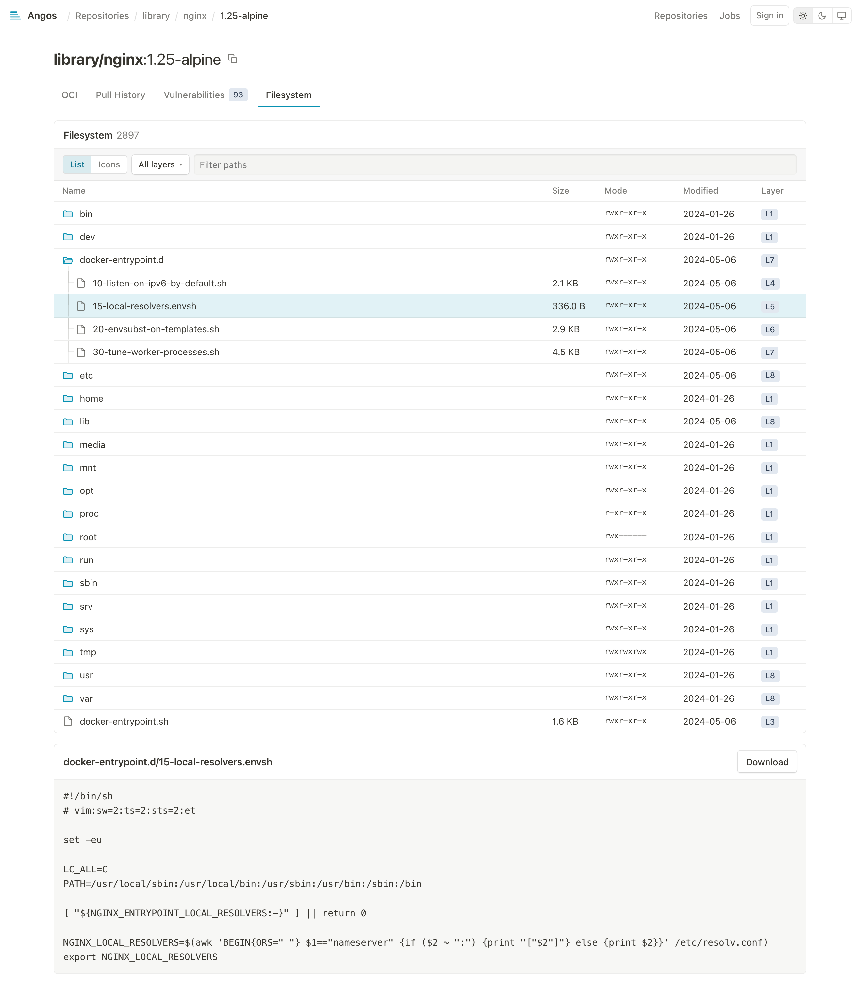

# Explore an Image's Filesystem

Browse what an image contains, layer by layer, and open any file, from the web UI.

## Prerequisites

- Angos running with the [web UI](enable-web-ui.md) enabled
- Readers with the `get-blob` action on the namespace, which is what the layer endpoints check

## How It Works

1. A layer is a tar stream, usually gzipped. An `index` job walks it once and keeps, by the layer digest, a listing of its entries with their offsets and, for a gzipped layer, an inflater checkpoint every 4 MiB of output.
2. The manifest page fetches the listing of each layer and merges them the way a runtime does: an entry replaces the lower layers' one, a whiteout removes a path, an opaque marker empties a directory.
3. Opening a file decodes the layer from the nearest checkpoint to the file's offset, so a file deep in a large layer costs a few megabytes of decoding, not the whole layer.

The listing is derived from the blob and shared like it: two images with the same layer share one listing, and it goes when the blob is reclaimed, or when `angos reconcile index` runs while no image an index policy applies to uses the layer. zstd-compressed layers are not indexed.

---

## Step 1: Open an Image

Open any image manifest in the web UI. Its page ends with a Filesystem panel. An image nobody indexed yet shows "Indexing" while the registry, or a worker, walks its layers; a few seconds for a small image, longer for a large one.

## Step 2: Browse

Folders open on click, as a tree in the list view or as tiles walked with the folder path in the icon view. The layer column names the layer that last set each entry, `L1` being the lowest. Check one or more layers in the layers menu to see only what those layers added, changed or removed, the removed paths struck through, or type in the filter to narrow the tree to matching paths.

<picture>
  <source media="(prefers-color-scheme: dark)" srcset="../images/ui-filesystem-dark.png" />
  <source media="(prefers-color-scheme: light)" srcset="../images/ui-filesystem-light.png" />
  
</picture>

## Step 3: Open a File

Click a file to read it under the tree, up to 512 KiB, or download it whatever its size. A hard link opens its target. A symlink shows where it points and, clicked, is followed there, through any links on the way; one that leads out of the image says so.

## Step 4: Index on Push

Indexing on first open is fine for a registry browsed now and then. A repository whose images are opened as soon as they land indexes them as they land:

```toml
[repository."apps".index]
default = "index"
```

To index every repository this way, put the policy under `[global]` instead:

```toml
[global.index]
default = "index"
```

An `index` table is a policy shaped like an access policy, the same as a `scan` table: `default` is `index` or `skip`, `skip` when absent, and `rules` over the [retention variables](../reference/cel-expressions.md#retention-policy-variables) give a matching image the opposite, judged as the image lands under its pushed tags and again by `reconcile index`. `rules = ["image.tag == 'latest' || top_pulled(20)"]` with no `default` indexes the tags people open and leaves the rest to their first open.

Each image manifest pushed there, or stored by a cache miss in a pull-through repository, enqueues one `index` job per layer. `angos worker` drains the queue, sized by `max_concurrent_index_jobs` (default 1, since a job inflates a whole layer), and the server drains it in-process without a durable queue. The jobs list under the `index` queue of the Jobs page.

## Step 5: Index What Was Already There

The policy covers images from then on. To have the listings of the images already in the repository ready before anyone opens them:

```bash
angos -c config.toml reconcile index
```

It enqueues one job per tar layer without a listing, a shared layer once, and reclaims the listings of the layers no image an index policy applies to uses; `--dry-run` lists both, and `--force` walks every layer again. The server or a worker drains the jobs as usual.

To stop indexing a repository, drop its `index` table, or give it `default = "skip"` under a global policy, and run the same command: the listings its images accumulated go, while any image still indexes itself the first time someone opens its filesystem.

---

## Reference

- [API Endpoints Reference](../reference/api-endpoints.md#layer-entries) - The layer endpoints
- [Configuration Reference](../reference/configuration.md#index-repositorynamespaceindex) - The `index` table
- [Web UI Reference](../reference/ui.md) - The Filesystem panel
