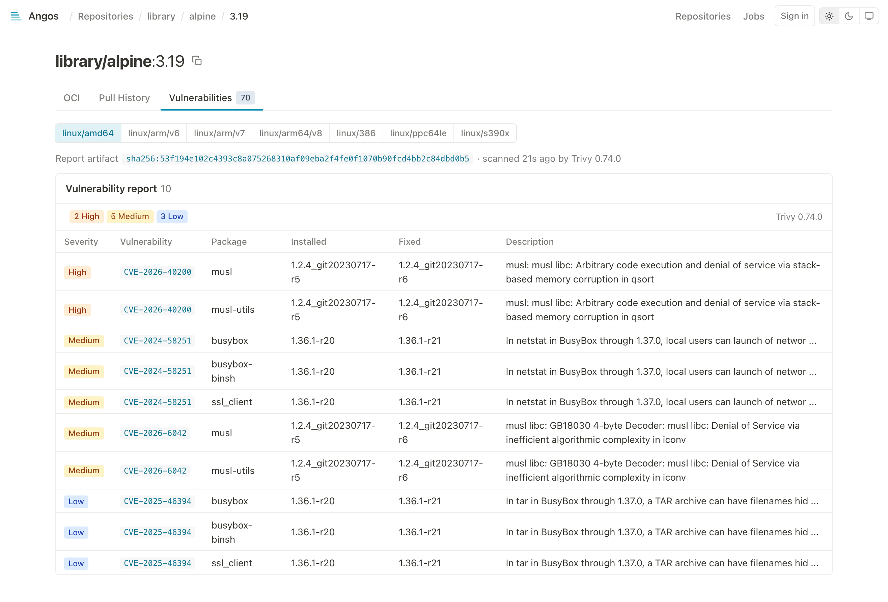

# Scan Images with an External Scanner

Run a vulnerability scanner on every push and keep its report next to the image as an OCI referrer.

## Prerequisites

- Angos running
- A scanner host the registry can reach over HTTP, with the `angos` binary and [Trivy](https://trivy.dev/) or [Grype](https://github.com/anchore/grype) installed

## How It Works

1. A push of an image manifest into a repository with a `scan` table enqueues a scan job, keyed on the image digest so repeated pushes coalesce.
2. The job's handler, in `angos worker` or in the server's own job loops, asks the scanner service for a report.
3. `angos scanner`, on the scanner host, pulls the image under its own identity, runs the scanner you named, and answers with the SARIF report.
4. The handler pushes the report back as a referrer of the image, an OCI artifact manifest whose `subject` is the image, through the registry's own write path. It lists under `/v2/<name>/referrers/<digest>`, replicates with the image, shows in the web UI, and is checked at admission by tools such as Kyverno or the sigstore policy-controller.

The job is durable: a failed scan retries with backoff and dead-letters, a job in flight when a worker dies is re-claimed, and the `_angos/jobs` admin API lists, retries and deletes scan jobs like any other. The registry runs no scanner itself. A report, an attestation or an index is never a scan subject, and a re-run of a job whose report already exists is a no-op.

---

## Step 1: Give the Scanner an Identity

The scanner pulls images to analyse them, so it needs read access. On the registry:

```toml
[auth.identity.scanner]
username = "scanner"
password = "$argon2id$v=19$m=19456,t=2,p=1$..."   # from `angos argon`

[repository."apps".access_policy]
default = "deny"
rules = [
  "identity.id == 'scanner' && request.action in ['get-manifest', 'get-blob']",
  # ...your usual rules...
]
```

The report is pushed by the registry's job handler, not by the scanner, so the identity needs no push rights.

## Step 2: Enable Scanning on the Registry

```toml
[global.scan]
url = "http://scanner.internal:8766"
token = "scan-service-secret"

[repository."apps".scan]
```

Each repository with a `scan` table, even an empty one, sends its image pushes to the service at `url`. A pull-through cache repository may carry the table too: each image manifest a cache miss stores is scanned once, and the report is local metadata that retention reclaims with the cached image. On a busy general-purpose mirror that is one scan per upstream digest pulled, so weigh the scanner time before enabling it there.

## Step 3: Run the Scanner Service

On the scanner host, write the service's configuration. `angos scanner` reads the `[scanner]` section alone, so nothing else from the registry's configuration is needed:

```toml
[scanner]
port = 8766                        # the port Step 2's URL names
token = "scan-service-secret"      # the same token as in Step 2

[scanner.registry]
url = "https://registry.example.com"
username = "scanner"
password = "..."                   # the scanner identity's password
```

Then, with `grype` or `trivy` on `PATH`:

```bash
RUST_LOG=info angos -c scanner.toml scanner grype
```

At `info` it logs one line per image scanned. See the [configuration reference](../reference/configuration.md#scanner-service-scanner) for the other options.

The same service runs as a container from the registry image, with the scanner's own image mounted read-only on `PATH`. The registry image has no `/tmp` and nothing writable, so mount a directory there for the scanner's temporary files and its database (`XDG_CACHE_HOME`), world-writable since the image runs as user 65534. Docker calls image mounts experimental and needs the image pulled first:

```bash
mkdir -m 1777 scanner-tmp
docker pull anchore/grype:latest
docker run -d -p 8766:8766 -v "$PWD/scanner.toml:/scanner.toml" -v "$PWD/scanner-tmp:/tmp" \
  --mount type=image,source=anchore/grype:latest,target=/opt/scanner \
  -e PATH=/opt/scanner:/opt/scanner/usr/local/bin -e XDG_CACHE_HOME=/tmp \
  ghcr.io/project-angos/angos:latest -c /scanner.toml scanner grype
```

For Trivy, mount `aquasec/trivy:latest` instead; the `PATH` above covers both layouts. A `--tmpfs /tmp` works too, but then Grype's database, about two gigabytes, lives in memory and is fetched on every start. On Kubernetes 1.35 or later an image volume mounts the same image at the same path, with an `emptyDir` on `/tmp`:

```yaml
containers:
  - image: ghcr.io/project-angos/angos:latest
    args: [-c, /scanner.toml, scanner, grype]
    env:
      - { name: PATH, value: /opt/scanner:/opt/scanner/usr/local/bin }
      - { name: XDG_CACHE_HOME, value: /tmp }
    volumeMounts:
      - { name: scanner, mountPath: /opt/scanner, readOnly: true }
      - { name: tmp, mountPath: /tmp }
volumes:
  - name: scanner
    image: { reference: anchore/grype:latest, pullPolicy: Always }
  - { name: tmp, emptyDir: {} }
```

## Step 4: Drain the Scan Queue

With `[global.job_queue]` configured, scan jobs are durable and a worker drains them:

```bash
angos -c config.toml worker --queue scan
```

A plain `angos worker` drains the scan queue as well whenever `[global.scan]` is set. Without `[global.job_queue]`, the server drains its own in-process queue and no worker is needed. `max_concurrent_scan_jobs` (default 2) bounds the scans in flight per process.

## Step 5: Push and Verify

Push an image into a scanning repository:

```bash
docker push registry.example.com/apps/web:1.0
```

The job appears under `GET /v2/_angos/jobs/list?queue=scan`, and under the `scan` queue of the web UI's Jobs page, until the report lands. The report then lists as a referrer:

```bash
oras discover registry.example.com/apps/web:1.0
```

The web UI shows it on the manifest's Vulnerabilities tab, whichever scanner wrote it, listing every finding with its package, fixed version and advisory link, and badges the report in the tree with the severity counts.

<picture>
  <source media="(prefers-color-scheme: dark)" srcset="../images/ui-vulnerabilities-dark.png" />
  <source media="(prefers-color-scheme: light)" srcset="../images/ui-vulnerabilities-light.png" />
  
</picture>

## Step 6: Scan What Was Already There

A `scan` table covers pushes from then on. Give the images already in the repository a report with:

```bash
angos -c config.toml reconcile scan
```

It enqueues one job per image manifest without a report, and one per image the refresh rules of Step 7 find due; `--dry-run` lists them, and `--force` scans every image again, attaching a fresh report to each. The server or a worker drains the jobs as usual.

## Step 7: Refresh Reports on a Schedule

A report ages as the scanner's database learns new vulnerabilities. The `refresh` table has `angos reconcile scan` scan an image again once its newest report is due, as its rules define it:

```toml
[global.scan.refresh]
rules = ["image.scanned_at < now() - days(30)"]

[repository."apps".scan.refresh]
rules = [
  "image.scanned_at < now() - days(7) && (image.tag == 'latest' || top_pulled(20))",
]
```

`rules` are CEL expressions over the [retention variables](../reference/cel-expressions.md#retention-policy-variables) plus `image.scanned_at`, the time of the image's newest report: the image is scanned again when any rule is true, so a rule states how old a report may get, and can narrow that to the tags that matter. A repository's rules replace the global ones, and a repository without rules of its own or inherited never refreshes a report. A repository table lists at least one rule, and a rule using `last_pulled_at` or `top_pulled` needs `update_pull_time = true`, as retention does. A tagged image is judged under each of its tags and an untagged one with `image.tag == null`, as retention judges them.

Nothing runs the pass on its own: schedule `angos reconcile scan` like `prune`, with a CronJob or a systemd timer, at the cadence the rules call for. A run reads every image of the scanning repositories once, one manifest read and one referrer listing each, enqueues a scan for each one without a report or whose newest report is due, and logs how many; a run that finds nothing due enqueues nothing, and a scan enqueued twice coalesces on the image. A daily run refreshes a report within a day of its rule coming true:

```yaml
apiVersion: batch/v1
kind: CronJob
metadata:
  name: registry-scan-refresh
spec:
  schedule: "0 4 * * *"
  jobTemplate:
    spec:
      template:
        spec:
          containers:
            - name: refresh
              image: ghcr.io/project-angos/angos:latest
              args: ["-c", "/config/config.toml", "reconcile", "scan"]
              volumeMounts:
                - name: config
                  mountPath: /config
                  readOnly: true
          volumes:
            - name: config
              secret:
                secretName: registry-config
          restartPolicy: OnFailure
```

A new report supersedes the older ones, and retention reclaims them: `angos prune` judges a superseded report like any untagged manifest, `pushed_at` being when it was attached, so `image.pushed_at > now() - days(30)` keeps a month of report history, a tag-only policy reclaims it at the next run, and a registry without retention rules keeps it. Only the newest report of an image stays shielded by it, as every report or attestation angos did not write does. The web UI shows the newest report by its `created` annotation either way.

---

## Notes

- **The scanner's database.** The service pulls Grype's database when it starts, refusing to start without one, and refreshes it once a day; a scan never updates it. Trivy refreshes its own during scans. Keep the scanner itself current: an old release is tied to a retired database feed and never finds a newer one.
- **Trivy scans one image at a time.** It locks its cache directory, so the service ignores `max_concurrent_scans` for Trivy; run several services on several hosts to scan in parallel. Grype scans concurrently.
- **The scanner service is stateless.** `POST /scan` with `{"namespace": ..., "digest": ...}` answers the SARIF report; the service holds only its pull identity and can be scaled or replaced independently of the registry.
- **The report is a plain OCI artifact.** An empty config, one SARIF layer, `artifactType: application/sarif+json`, and the image as `subject`. Nothing is written under cosign's fallback tags, so nothing counts against `top_pushed` and `top_pulled` rankings.
- **A scan is bounded by `timeout_secs`** (default 600) on the registry side; a scanner that overruns fails the job, which retries.

---

## Retention

A report follows its image: `angos prune` skips it while the image resolves and reclaims it with the image. Attaching a report never keeps an image alive. A report a newer angos report has superseded is the exception: prune judges it by the retention rules like any untagged manifest. See [Configure Retention Policies](configure-retention-policies.md).

---

## Enforcement

Angos does not block a pull on a scan result. Enforce at admission, where the same referrers are read: Kyverno `verifyImages` and the sigstore policy-controller check an attestation by predicate type, for example `https://cosign.sigstore.dev/attestation/vuln/v1` for a report attached with `cosign attest --type vuln`.

## Reference

- [CLI Reference](../reference/cli.md#scanner) - The `scanner` subcommand and the worker's `scan` queue
- [Configuration Reference](../reference/configuration.md#scanning-globalscan) - The `[global.scan]`, `scan` and `[scanner]` tables
- [API Endpoints Reference](../reference/api-endpoints.md#list-jobs) - The jobs admin API
- [Web UI Reference](../reference/ui.md) - Attestation badges
