# Web UI Reference

Reference for the Angos web interface.

---

## Configuration

```toml
[ui]
enabled = true
name = "My Registry"
```

| Option    | Type   | Default             | Description                           |
|-----------|--------|---------------------|---------------------------------------|
| `enabled` | bool   | `false`             | Enable the web interface              |
| `name`    | string | `"Angos"` | Registry name displayed in the top bar |

### Sign-in

```toml
[ui.oidc]
provider = "dex"
client_id = "angos-ui"
```

| Option      | Type   | Default                  | Description                                          |
|-------------|--------|--------------------------|------------------------------------------------------|
| `provider`  | string | required                 | The `auth.oidc` provider to sign in against          |
| `client_id` | string | required                 | The provider's public client, holding no secret      |
| `scopes`    | string | `"openid profile email"` | The OAuth `scope` parameter, verbatim                |

`provider` names a configured `[auth.oidc.<name>]` section and the registry refuses
to start when no such provider exists. The issuer is read from it, so the browser
can only be sent to an issuer the registry validates tokens from.

Without this section the UI offers no sign-in and sends no credentials, which is
what a registry readable anonymously or fronted by an authenticating proxy wants.

---

## URL Structure

URLs follow Docker reference format:

| URL                                  | View             | Description                 |
|--------------------------------------|------------------|-----------------------------|
| `/`                                  | Repository list  | All configured repositories |
| `/{repository}`                      | Namespace list   | Images within a repository  |
| `/{repository}/{namespace}`          | Manifest list    | All manifests for an image  |
| `/{repository}/{namespace}:{tag}`    | Manifest details | Manifest by tag             |
| `/{repository}/{namespace}@{digest}` | Manifest details | Manifest by digest          |
| `...#history`, `...#vulnerabilities`, `...#filesystem` | Manifest details | A manifest's Pull History, Vulnerabilities or Filesystem tab; no anchor opens the OCI tab, and `...#vulnerabilities/linux/arm64` one platform's report of an index |
| `/jobs/{queue}`                      | Jobs             | Pending and failed jobs of the `cache`, `replication` or `scan` queue; `/jobs` opens the cache queue |

**Examples:**
- `/` - List all repositories
- `/library` - List namespaces in the "library" repository
- `/library/nginx` - List all nginx manifests
- `/library/nginx:latest` - Details for the latest tag
- `/library/nginx@sha256:abc123...` - Details for a specific digest

---

## API Endpoints

### UI Configuration

```
GET /v2/_angos/ui/config
```

Returns the UI configuration.

**Response:**
```json
{
  "name": "My Registry",
  "oidc": {
    "issuer": "https://dex.example.com",
    "client_id": "angos-ui",
    "scopes": "openid profile email"
  }
}
```

The `oidc` object is present only when `[ui.oidc]` is configured. Every field in
it is public by nature: the client holds no secret. The endpoint itself needs no
credentials, since the UI reads it before anyone has signed in.

### Static Assets

Static assets have no dedicated URL prefix. Every `GET` or `HEAD` request outside the API routes (`/v2/...`, `/healthz`, `/readyz`, `/metrics`) serves the embedded single-page app, falling back to `index.html` for paths that match no bundled asset.

---

## Access Control Actions

UI-specific actions for access policies:

| Action              | Description                               |
|---------------------|-------------------------------------------|
| `ui-asset`          | Static files (JS, CSS, images)            |
| `ui-config`         | UI configuration endpoint (`/v2/_angos/ui/config`) |
| `list-repositories` | Repository list view                      |
| `list-namespaces`   | Namespace list view                       |
| `list-revisions`    | Manifest list view                        |
| `list-uploads`      | Active uploads view                       |

Allowing `list-repositories` and `list-namespaces` does not expose every
repository: both listings serve a repository only while it holds a namespace the
caller could list tags under. A repository whose `access_policy` denies them
stays out of the UI and answers as an absent one when opened directly, and so
does a repository that is simply empty, which is what keeps the two apart from
being told apart.

### Minimal Policy for UI Access

```toml
[global.access_policy]
default = "deny"
rules = [
  # Allow UI to load
  "request.action == 'ui-asset' || request.action == 'ui-config'",

  # Allow authenticated users to browse
  "identity.username != null && request.action.startsWith('list-')",

  # Allow reading manifests
  "identity.username != null && request.action == 'get-manifest'"
]
```

### Read-Only Policy

```toml
rules = [
  "request.action == 'ui-asset' || request.action == 'ui-config'",
  "identity.username != null && request.action.startsWith('list-')",
  "identity.username != null && request.action == 'get-manifest'",
  "identity.username != null && request.action == 'get-referrers'",
  "identity.username != null && request.action == 'get-blob'"
]
```

### Full Access Policy

```toml
rules = [
  "request.action == 'ui-asset' || request.action == 'ui-config'",
  "identity.username != null"
]
```

---

## Views

### Repository List

<picture>
  <source media="(prefers-color-scheme: dark)" srcset="../images/ui-repositories-dark.png" />
  <source media="(prefers-color-scheme: light)" srcset="../images/ui-repositories-light.png" />
  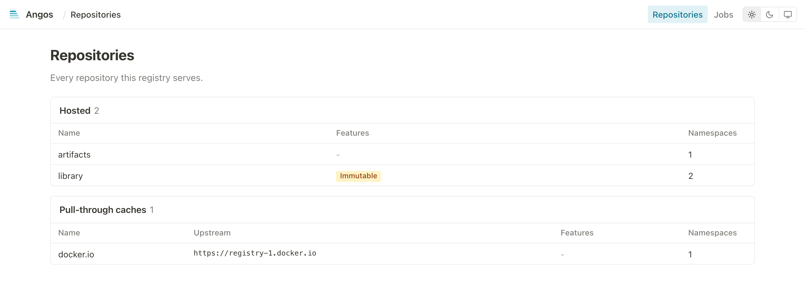
</picture>

Displays the configured repositories in two tables, the hosted ones first and the pull-through caches, when any are configured, after them, each with:
- Repository name
- Upstream registry, for a cache
- **Immutable** badge, when immutable tags are enabled
- Namespace count

### Namespace List

<picture>
  <source media="(prefers-color-scheme: dark)" srcset="../images/ui-namespaces-dark.png" />
  <source media="(prefers-color-scheme: light)" srcset="../images/ui-namespaces-light.png" />
  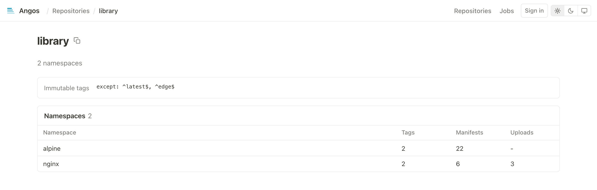
</picture>

Displays images within a repository:
- Image name (namespace)
- Manifest count
- Upload count (if any in progress)
- Repository configuration summary

### Manifest List

<picture>
  <source media="(prefers-color-scheme: dark)" srcset="../images/ui-manifests-dark.png" />
  <source media="(prefers-color-scheme: light)" srcset="../images/ui-manifests-light.png" />
  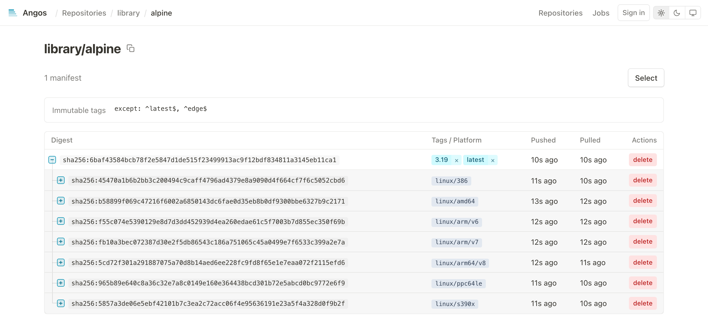
</picture>

Tree view of all manifests:
- Multi-platform indexes with expandable children
- Platform badges (e.g., `linux/amd64`, `linux/arm64`)
- Attestations badges: SBOM, SLSA, signature, vulnerability report, etc.
- Tags as clickable badges
- Digest (shortened, click to copy full)
- Push time
- Last pull time (if tracked): the newest pull by digest or through any of its tags

### Manifest Details

The page opens with a **title**, the full name it was addressed by (`namespace:tag` or `namespace@digest`) with a copy button, and splits the detail into tabs. Each tab has its own URL, the anchor naming it (`#history`, `#vulnerabilities`, `#filesystem`) and none for OCI, so a tab can be linked to; an anchor naming a tab the manifest lacks opens OCI. On a multi-platform index the platform shown follows, as in `#vulnerabilities/linux/arm64`.

#### OCI

<picture>
  <source media="(prefers-color-scheme: dark)" srcset="../images/ui-manifest-details-dark.png" />
  <source media="(prefers-color-scheme: light)" srcset="../images/ui-manifest-details-light.png" />
  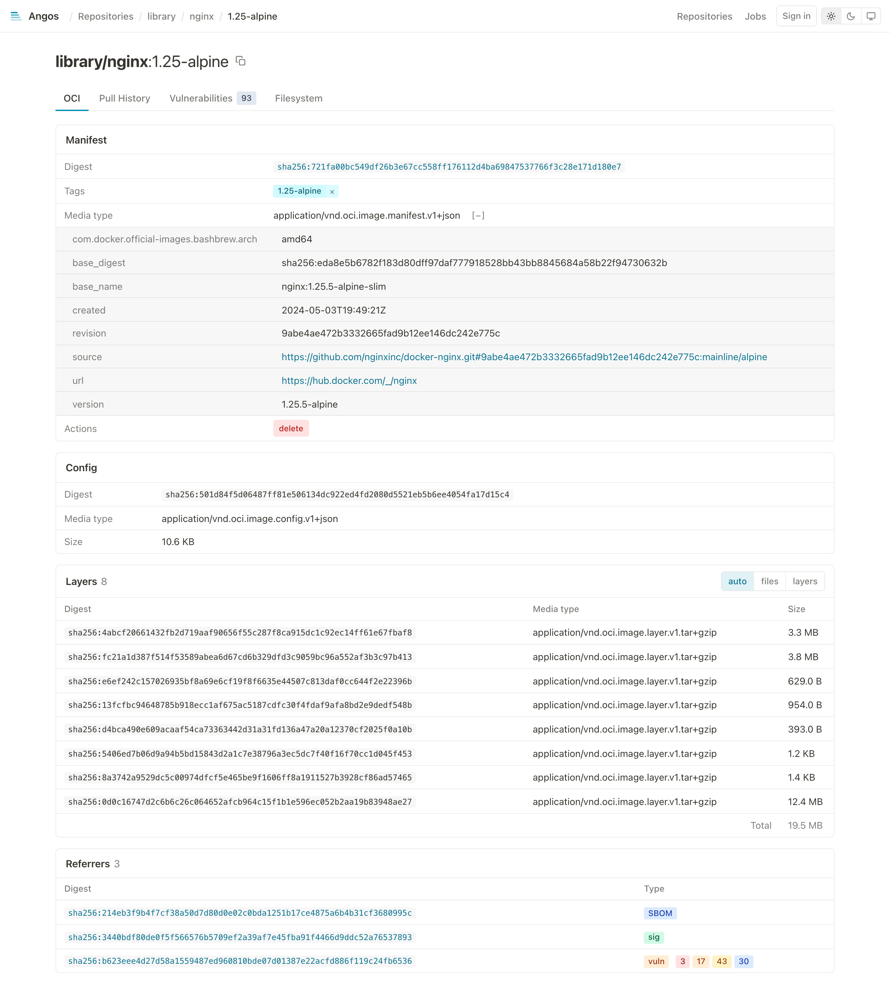
</picture>

The manifest (digest, tags with delete buttons, media type, artifact type, subject, expandable annotations, a delete action), the config, the layers (or, for an ORAS artifact, its files with download links), an index's platform manifests, the referrers (signatures, SBOMs, reports), and what references the manifest. Referrers load the first 100 with the view; a "Load more referrers" control fetches the next page, which needs the `get-referrers` action.

For a multi-platform index, the platform manifests are listed with their referrers nested beneath, each attestation carrying its `SBOM`, `SLSA` or `vuln` badge:

<picture>
  <source media="(prefers-color-scheme: dark)" srcset="../images/ui-manifest-index-dark.png" />
  <source media="(prefers-color-scheme: light)" srcset="../images/ui-manifest-index-light.png" />
  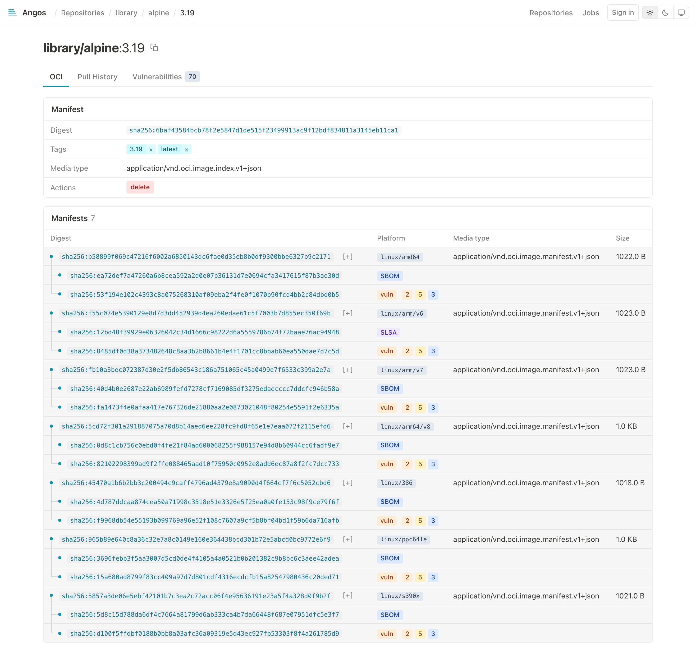
</picture>

#### Pull History

<picture>
  <source media="(prefers-color-scheme: dark)" srcset="../images/ui-pull-history-dark.png" />
  <source media="(prefers-color-scheme: light)" srcset="../images/ui-pull-history-light.png" />
  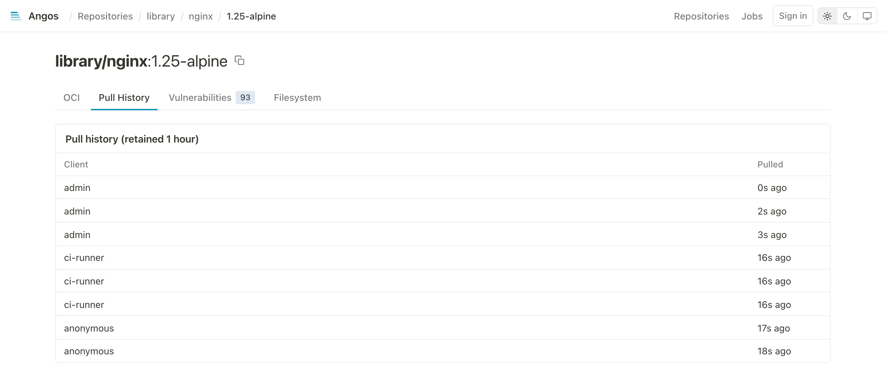
</picture>

The newest 100 recorded pulls of the reference the view was addressed by, a tag and a digest recorded separately, each naming the client that pulled. The heading states the configured retention, since superseded entries are collected past it; recording happens only when `update_pull_time` is enabled.

#### Vulnerabilities

<picture>
  <source media="(prefers-color-scheme: dark)" srcset="../images/ui-vulnerabilities-dark.png" />
  <source media="(prefers-color-scheme: light)" srcset="../images/ui-vulnerabilities-light.png" />
  
</picture>

Shown only when a report is attached, with the total finding count in a grey square on the tab: the report inline, its findings filterable by severity, each with the package, installed and fixed versions and a link to the advisory, and the scanner named. A multi-platform index gets a sub-tab per platform manifest that has a report. The counts also appear next to the `vuln` badge in the manifest tree and in referrer lists, as count pills coloured by severity with the severity named on hover.

#### Filesystem

<picture>
  <source media="(prefers-color-scheme: dark)" srcset="../images/ui-filesystem-dark.png" />
  <source media="(prefers-color-scheme: light)" srcset="../images/ui-filesystem-light.png" />
  
</picture>

Shown only for an image with tar layers: the layers merged into one tree, the way a runtime applies them, whiteouts removing what lower layers put there, and every entry carrying the layer that last set it. Opening a file shows it beside the list, in view while the list scrolls: its metadata and digests over its text with numbered lines, syntax colored for common languages, markdown rendered, images shown, an ELF binary's type, architecture, loader, hardening and the libraries it needs, a PEM file's certificates listed with their expiry, a diff against another layer's version, the first 512 KiB of a larger one, a chip per layer holding a version of it, and a Download button; a symlink is followed to its target. Both go through the registry's layer endpoints, which need the `get-blob` action. The open file is in the URL (`#filesystem/<path>`, `@L<n>` for another layer's version), Esc closes it, and the arrow keys and Enter walk each view. The first visit to an image nobody indexed shows "Indexing" until the registry's index jobs have walked its layers, and a listing an older version indexed shows with a notice until its layer is indexed again. Beside the **Tree** and **Icons** views, a **Secrets** view lists the files of any layer holding a private key, a service token or a credential anywhere in their text, removed ones included, with the lines they are on, marked when the file opens, a **Permissions** view lists the setuid, setgid and world-writable files and folders and the files granted Linux capabilities, and a **Waste** view measures the bytes later layers overwrote or removed and the bytes spent on identical files, each file of either opening on click, the overwritten ones as their layer holds them.

The **icon view** walks the tree folder by folder as tiles:

<picture>
  <source media="(prefers-color-scheme: dark)" srcset="../images/ui-filesystem-icons-dark.png" />
  <source media="(prefers-color-scheme: light)" srcset="../images/ui-filesystem-icons-light.png" />
  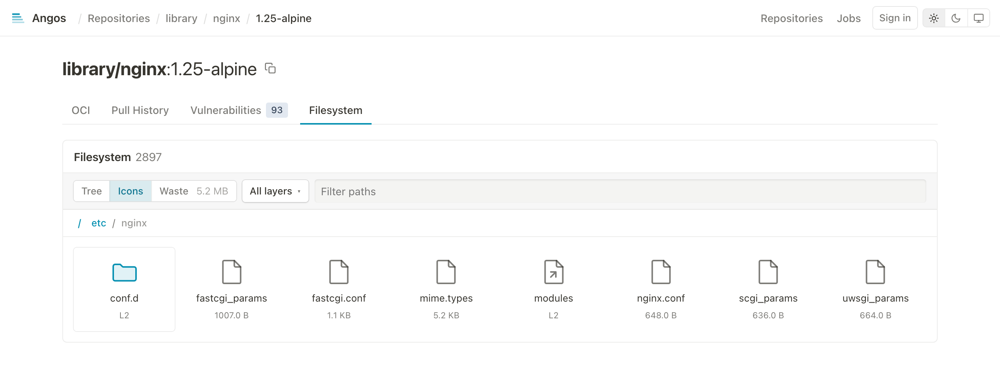
</picture>

The **layers menu** narrows the tree to what the checked layers added, changed or removed, and a path filter narrows it to matching names:

<picture>
  <source media="(prefers-color-scheme: dark)" srcset="../images/ui-filesystem-layers-dark.png" />
  <source media="(prefers-color-scheme: light)" srcset="../images/ui-filesystem-layers-light.png" />
  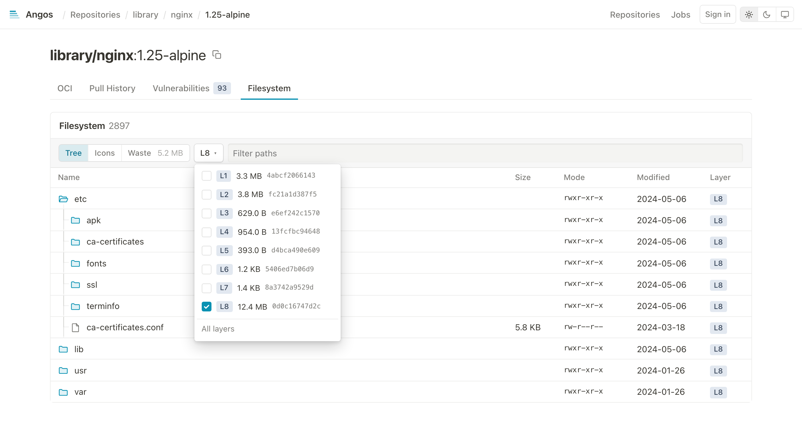
</picture>

### Uploads

<picture>
  <source media="(prefers-color-scheme: dark)" srcset="../images/ui-uploads-dark.png" />
  <source media="(prefers-color-scheme: light)" srcset="../images/ui-uploads-light.png" />
  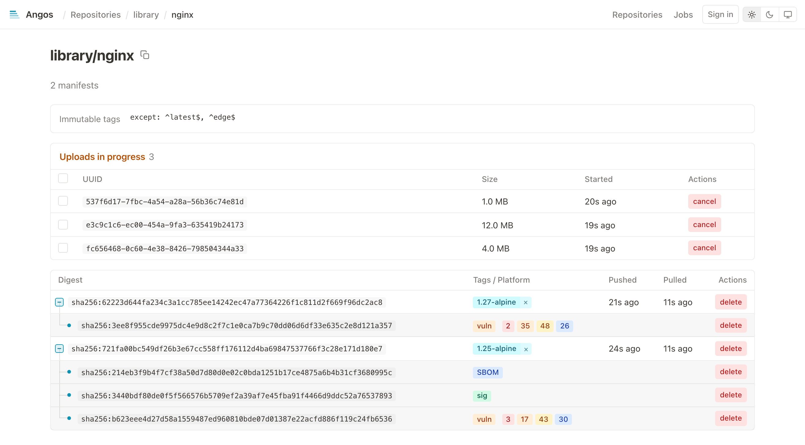
</picture>

Shows in-progress blob uploads:
- Upload UUID
- Current size
- Start time
- Cancel button

### Jobs

<picture>
  <source media="(prefers-color-scheme: dark)" srcset="../images/ui-jobs-dark.png" />
  <source media="(prefers-color-scheme: light)" srcset="../images/ui-jobs-light.png" />
  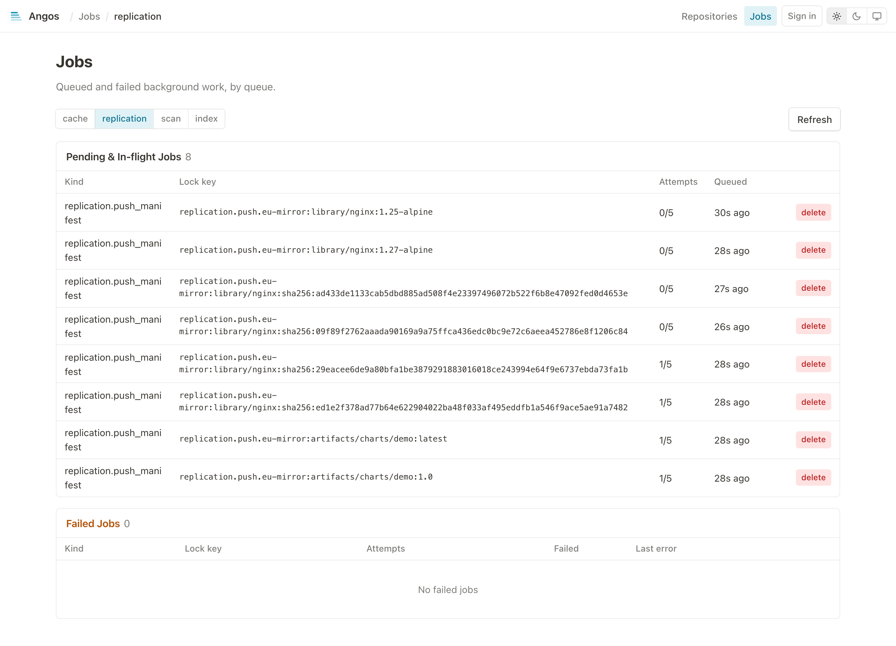
</picture>

Lists the durable background work of each queue, one URL per queue (`/jobs/cache`, `/jobs/replication`, `/jobs/scan`, `/jobs/index`), selected by the tabs at the top; `/jobs` opens the cache queue. Two tables:

- **Pending & In-flight**: the kind, lock key, attempt count and queued time of each job, with a `backoff` badge on one waiting out a retry delay, and a delete action.
- **Failed**: the jobs that exhausted their attempts and dead-lettered, with the last error, a **retry** that re-queues one and a delete that discards it.

---

## Interactive Features

### Delete Operations

Delete buttons require double-click confirmation:
1. First click: Arms the button (changes to red)
2. Second click: Executes the deletion
3. Click elsewhere: Disarms

**Deletable items:**
- Tags (removes tag, keeps the manifest unless a retention policy allows its deletion)
- Manifests (by digest), with what their going would orphan
- Uploads (cancels in-progress uploads)

**Deleting a manifest takes its orphans with it.** Deleting an index also deletes the platform
manifests no other index names and that carry no tag of their own, and the referrers (signatures,
SBOMs, scan reports) of everything removed, since a referrer without its subject has nothing left
to describe. A platform manifest another index still names, and anything tagged, stays. The armed
confirm button names what goes, as `confirm (+2 platform, +1 attestation)`. The registry's own
`DELETE` is per manifest and unchanged: this is the web UI deleting what a retention policy would
otherwise reclaim later, which matters most when no retention policy is configured, since untagged
manifests are then kept indefinitely.

**Deleting several manifests:** the **Select** button above the manifest table puts a checkbox
on every row, with one in the header that covers the rows at the top level. **delete selected
(N)** then arms and confirms like any other delete and sends one delete per manifest; the rows
that went disappear at once and the refresh reconciles the rest. **Done** leaves select mode, and
so does opening another page; the whole checkbox cell is the target, not only the box.

### Copy to Clipboard

The manifest page's title carries a copy button; it copies the full name, `namespace:tag` or `namespace@sha256:...`, so what is copied can be pulled as is.

### Theme Toggle

Toggle between light, dark and system themes with the switcher at the right of the top bar. Preference is saved in browser local storage.

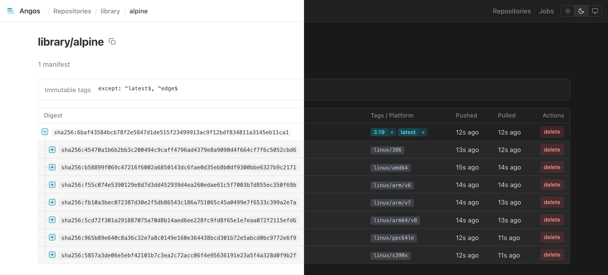

### Annotations Expansion

Click `[+]` to expand annotation values. Well-known annotation keys are displayed with friendly names:
- `org.opencontainers.image.title` → Title
- `org.opencontainers.image.description` → Description
- `org.opencontainers.image.version` → Version
- `org.opencontainers.image.created` → Created
- `org.opencontainers.image.source` → Source

---

## ORAS Artifacts

<picture>
  <source media="(prefers-color-scheme: dark)" srcset="../images/ui-oras-files-dark.png" />
  <source media="(prefers-color-scheme: light)" srcset="../images/ui-oras-files-light.png" />
  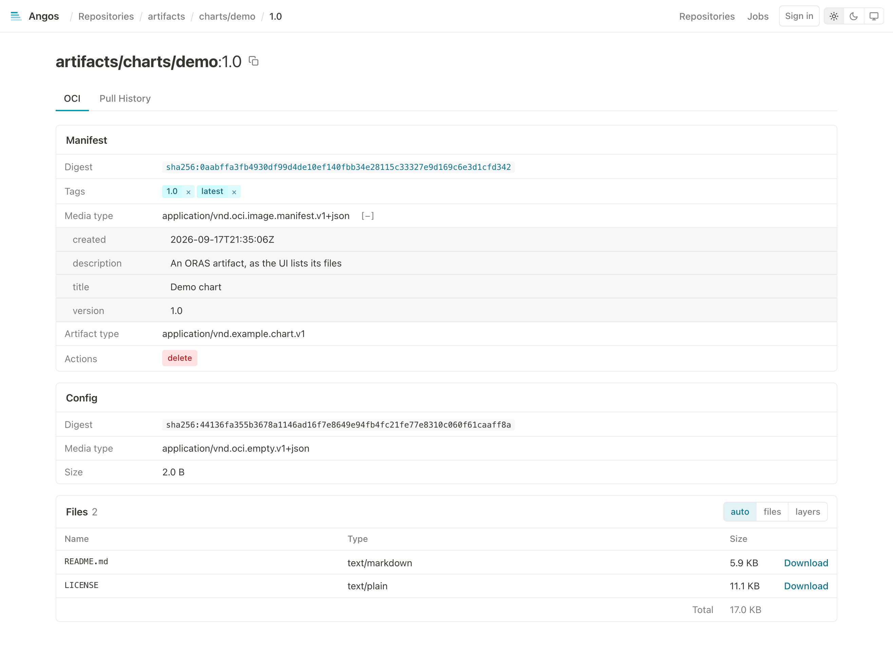
</picture>

For OCI artifacts (non-container content), the UI displays:
- Filename (from annotations or media type)
- Media type
- Size
- Download button

Download URL format:
```
/v2/{namespace}/blobs/{digest}
```

---

## Platform Display

Multi-platform images show platform information:

| Badge           | Meaning                |
|-----------------|------------------------|
| `linux/amd64`   | Linux on x86_64        |
| `linux/arm64`   | Linux on ARM64         |
| `linux/arm/v7`  | Linux on ARMv7         |
| `windows/amd64` | Windows on x86_64      |
| `unknown`       | Platform not specified |

---

## Error States

| State        | Display                              |
|--------------|--------------------------------------|
| Loading      | Spinner animation                    |
| Not found    | 404 message with navigation          |
| Unauthorized | Sign-in starts, or a 401 message when already signed in |
| Forbidden    | 403 message explaining access denied |
| Server error | 500 message with retry option        |

---

## Browser Requirements

- Modern browser with JavaScript enabled
- ES2020+ support (Chrome 80+, Firefox 74+, Safari 14+, Edge 80+)
- CSS Grid and Flexbox support

---

## Related

- [Enable the Web UI](../how-to/enable-web-ui.md) - Setup guide
- [Set Up Access Control](../how-to/set-up-access-control.md) - Policy configuration
- [API Endpoints Reference](api-endpoints.md) - Extension APIs used by UI
